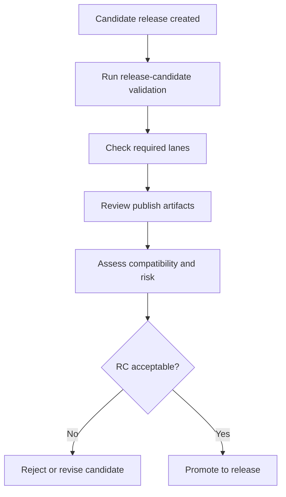

# Release Candidate Workflow

Release-candidate automation exists to prove readiness before publication,
instead of discovering missing evidence after the release starts.

## Release Candidate Decision Model

This workflow exists to force readiness questions into a single evidence bundle before public
publication work begins.

## Source Anchor

[`.github/workflows/release-candidate.yml`](/Users/bijan/bijux/bijux-atlas/.github/workflows/release-candidate.yml:1)
is the source of truth for the current release-candidate lane.

## What The Workflow Actually Does

The current workflow:

- accepts a version input for manual dispatch and also runs on pushed version tags
- prepares isolated cache and temp roots under `artifacts/isolates/release-candidate`
- runs release-candidate preflight through `bijux-dev-atlas`
- runs the release doctor gate when enabled
- validates docs completeness, release checks, reproducibility, and ops readiness
- builds distribution artifacts and uploads the full artifact bundle

That structure matters because an RC is not one command. It is a collected proof set that ties
release checks, docs, ops, and build output into one reviewable run.

## Evidence Produced

The workflow writes a named run bundle under `artifacts/${RUN_ID}` with reports such as:

- `release-candidate.json`
- `docs-completeness.json`
- `reproducibility-report.json`
- `release-check.json`
- `ops-readiness.json`
- checksum files and a human-readable summary

These artifacts are the RC evidence packet. A maintainer should inspect them before promotion rather
than treating workflow success alone as sufficient explanation.

## Promotion Rules

- reject the RC when required evidence is missing, contradictory, or only green because a warning path hid a serious regression
- revise the candidate when compatibility or docs obligations were not completed before tagging
- promote only when the RC evidence, release notes, and final-readiness story agree

## Main Takeaway

The release-candidate workflow is Atlas's rehearsal under evidence, not a ceremonial pre-release
button. Its job is to assemble the exact proof a maintainer needs to decide whether promotion is
honest.
