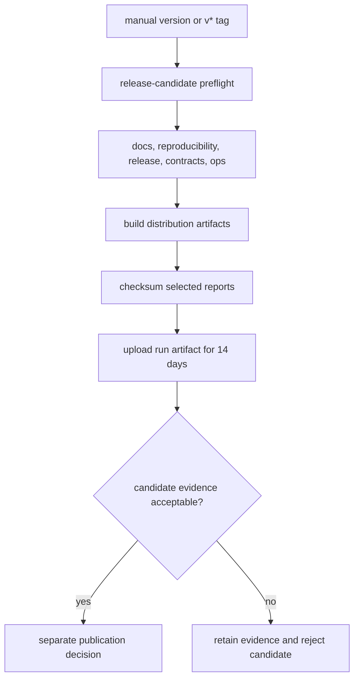

# Release Candidate Workflow

The release-candidate workflow assembles distribution output and a review
packet for a version tag or manual candidate. It is a one-hour, network-enabled
lane with isolated Cargo and temporary roots.

## Trigger and identity

Manual dispatch requires a version input and can enable the release doctor.
Any pushed `v*` tag also triggers the lane. The run identity is
`rc-<github-run-id>-<attempt>` and owns the uploaded artifact tree.

For tag-triggered runs, the manual `version` input is absent. Reviewers must
bind the Git tag, source commit, built package versions, and artifact metadata
directly; a summary line containing the dispatch input cannot establish that
identity for a tag run.

```mermaid
flowchart TD
    Trigger["manual version or v* tag"] --> Preflight["release-candidate preflight"]
    Preflight --> Reports["docs, reproducibility, release, contracts, ops"]
    Reports --> Dist["build distribution artifacts"]
    Dist --> Checksums["checksum selected reports"]
    Checksums --> Upload["upload run artifact for 14 days"]
    Upload --> Review{"candidate evidence acceptable?"}
    Review -- yes --> Publish["separate publication decision"]
    Review -- no --> Reject["retain evidence and reject candidate"]
```

## Hard and advisory outcomes

Not every named check fails the workflow in the same way.

| Work | Current failure behavior |
| --- | --- |
| release-candidate preflight | hard failure |
| optional release doctor | hard failure when enabled |
| docs validation | nonzero exit is recorded as `warn`; lane continues |
| reproducibility report | nonzero exit is recorded as `warn`; lane continues |
| release check | nonzero exit is recorded as `warn`; lane continues |
| release contracts | hard failure |
| operations readiness | nonzero exit is recorded as `warn`; lane continues |
| distribution build | hard failure |
| selected report checksums | hard failure if source files are absent |

Workflow success therefore does not mean every report passed. A reviewer must
open the gate records and reject a candidate with unresolved docs,
reproducibility, release-check, or operations warnings. The current soft-gate
behavior is an explicit evidence limitation, not permission to publish.

## Artifact packet

The run uploads `artifacts/<run-id>` for 14 days. Its reports include docs
validation, reproducibility, release checks, release contracts, operations
readiness, and the distribution build result. It also contains stderr logs,
gate records, selected SHA-256 files, and a human-readable summary.

The checksum step covers four reports. It does not sign the packet, checksum
every log and artifact, or establish provenance outside GitHub Actions. Apply
the release signing and provenance process before publication.

## Candidate decision

Accept a candidate only after confirming:

- trigger, source commit, tag or manual version, and built versions agree;
- all advisory gate files are `ok`, or a documented release decision rejects
  the candidate;
- contracts and distribution build completed without a hidden skip;
- artifact inventory, checksums, signatures, and provenance cover the intended
  publication set;
- docs, compatibility, operations, and rollback evidence describe the same
  release;
- the 14-day workflow retention is not the only long-term custody plan.

Publication happens in separate release workflows. A green candidate lane is
review input, not automatic authorization to publish.
