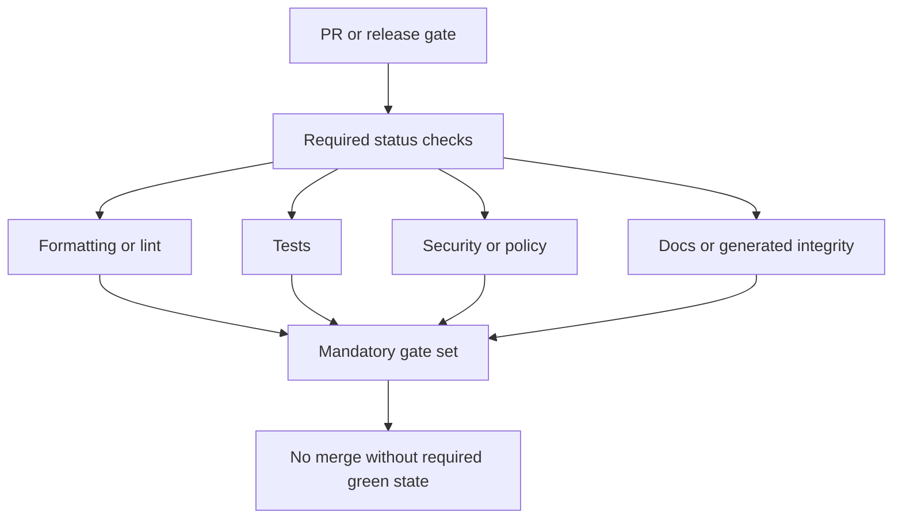

# Required Status Checks

Required status checks define the merge gate, so they belong in maintainer
documentation rather than being implicit in branch settings alone.

## Gate Model

This page exists because branch protection only shows the outcome. Maintainers still need a durable
reference that explains which checks are required, why they exist, and what has to be updated when a
workflow name changes.

## Source Anchor

[`.github/required-status-checks.md`](/Users/bijan/bijux/bijux-atlas/.github/required-status-checks.md:1)
is the source of truth for the named required checks and the rule that workflow and job renames must
update that file in the same change.

## Current Required Checks

The current branch-protection gate for `main` includes:

- `ci-pr / minimal-root-policies`
- `ci-pr / validate-pr`
- `ci-pr / supply-chain`
- `ci-pr / workflow-policy`
- `docs-only / docs`
- `ops-validate / validate`

Optional and nightly lanes exist as supporting signals, but they are not the same thing as the
required merge gate.

## Maintainer Rules

- when a workflow name or job name changes, update the required-status document in the same change
- do not infer branch protection from memory; use the checked-in file
- treat required checks as repository policy, not as CI implementation trivia
- keep optional or nightly lanes clearly labeled so reviewers do not confuse advisory coverage with merge requirements

## Main Takeaway

Required status checks are the declared merge contract between code review and CI. Atlas keeps that
contract in the repository so maintainers can review, evolve, and audit the gate instead of leaving
it hidden in settings or memory.
