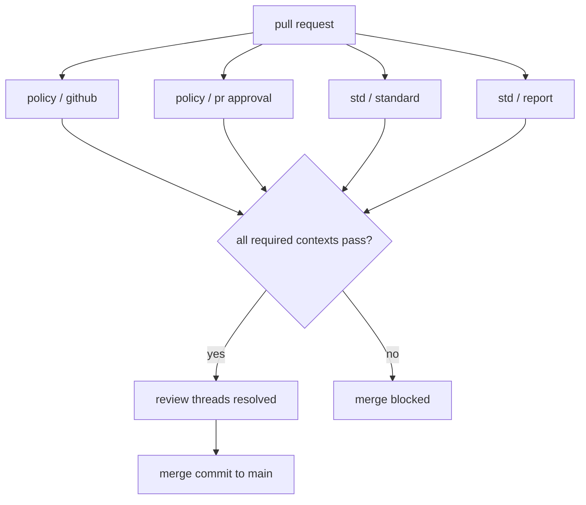

# Required Status Checks

The `main` ruleset requires four status contexts. The checked-in declaration
and ruleset currently agree:

| Required context | Workflow authority | Purpose |
| --- | --- | --- |
| `policy / github` | `github-policy.yml` | protected GitHub configuration policy |
| `policy / pr approval` | `pr-approval-policy.yml` | pull-request approval policy |
| `std / standard` | `bijux-std.yml` | shared-standard conformance |
| `std / report` | `bijux-std.yml` | shared-standard report |

These are baseline governance checks. Repository CI, documentation, operations,
security, performance, and release workflows provide additional evidence, but
they are not required contexts in the checked-in `main` ruleset today.

```mermaid
flowchart TD
    PR["pull request"] --> Policy["policy / github"]
    PR --> Approval["policy / pr approval"]
    PR --> Standard["std / standard"]
    PR --> Report["std / report"]
    Policy --> Merge{"all required contexts pass?"}
    Approval --> Merge
    Standard --> Merge
    Report --> Merge
    Merge -- yes --> ReviewThreads["review threads resolved"]
    ReviewThreads --> Main["merge commit to main"]
    Merge -- no --> Block["merge blocked"]
```

## Ruleset semantics

The ruleset also blocks branch deletion and non-fast-forward updates. It
requires pull requests, resolved review threads, strict status checks against
the current base, and merge commits. It currently requires zero approving
reviews and does not require Code Owner approval. Do not describe those reviews
as enforced until the ruleset changes.

The repository declaration says main-branch bypass is not allowed. Verify the
live GitHub ruleset when auditing enforcement because repository files describe
the intended configuration; they cannot prove that server-side settings have
not drifted.

## Changing a required context

GitHub matches the exact reported context string. A workflow or job rename can
strand pull requests if the ruleset still waits for the old name.

Change these surfaces together:

1. the producing workflow and job name;
2. `.github/required-status-checks.md`;
3. `.github/rulesets/main-branch-protection.json`;
4. any standards source that owns generated GitHub content;
5. the live repository ruleset after the reviewed change is accepted.

Because shared GitHub governance is synchronized from `bijux-std`, do not
hand-edit a generated consumer workflow to force a context rename. Change the
owning standard and refresh the consumer through the governed sync path.

## Review checklist

Before merging a gate change, confirm that each required context:

- runs on every pull request and merge queue event where it is required;
- reports the exact declared name;
- cannot succeed by skipping its protected evaluation;
- has least-privilege permissions;
- fails closed when its evidence is absent or malformed;
- is present in both the repository declaration and ruleset.

Optional lanes should remain visible in review, but their success must not be
mistaken for satisfaction of a required context.
