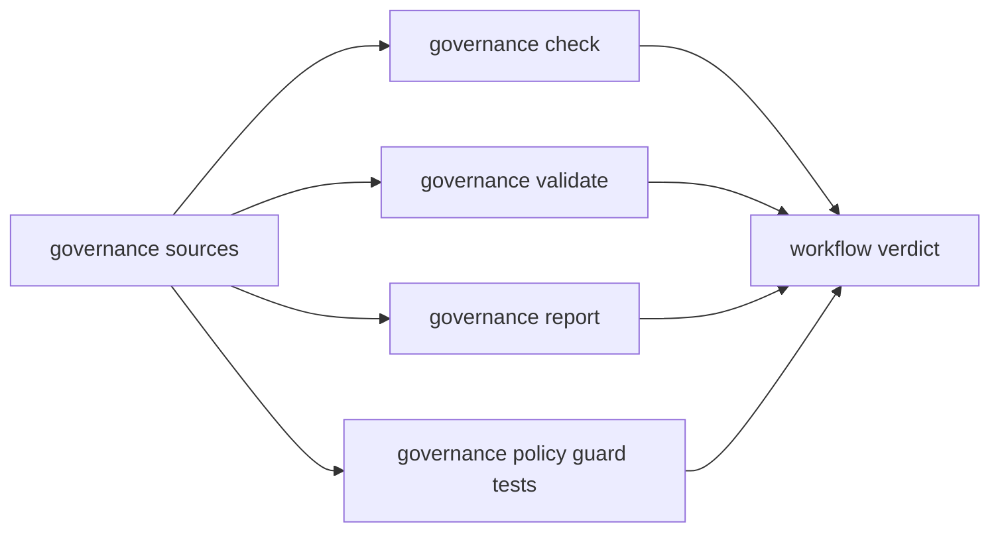

# Sustainability Validation Workflow

Governance sustainability asks whether repository rules remain discoverable,
owned, enforceable, and reviewable over time. It is not a general code-quality
lane. It validates governance contracts and their supporting evidence.

## Workflow Contract



The GitHub workflow runs four operations:

```bash
cargo run --locked -q -p bijux-atlas-dev -- governance check --format json
cargo run --locked -q -p bijux-atlas-dev -- governance validate --format json
cargo run --locked -q -p bijux-atlas-dev -- governance report --format json
cargo test --locked -p bijux-atlas-dev --test governance_policy_guards -- --nocapture
```

`check` evaluates governed rules. `validate` checks configuration and contract
integrity. `report` renders the current governance view. The guard suite
protects enforcement behavior against regression. All four must pass.

## Sustainability Surfaces

| Surface | Long-lived question |
| --- | --- |
| rule and contract registries | Is every enforced rule uniquely identified, categorized, and routed to an owner? |
| suite membership | Are checks reachable from the intended governed suites? |
| exceptions and relaxations | Is every bypass narrow, approved, attributable, and bounded? |
| ownership and review | Can a change reach the people accountable for its contract? |
| evidence integrity | Can a report be traced to the policy and source revision it evaluates? |
| documentation freshness | Do active interfaces and ownership paths have current reader guidance? |
| governance version history | Can a reviewer identify when and why enforcement meaning changed? |

Checked-in sustainability metrics, compliance reports, health indicators, and
maturity artifacts under `ops/governance/sustainability/` are evidence inputs.
Their presence is not proof that the numbers were freshly measured. Each value
needs a generator or collection method, source identity, capture time, and
review authority before it can support a trend or release claim.

## Interpret Failures by Owner

| Failure | Owning response |
| --- | --- |
| registry parse or schema failure | repair the source contract without bypassing enforcement |
| duplicate or unreachable rule | assign one durable identity and restore suite routing |
| expired or unapproved exception | remove the exception or complete the governed approval path |
| generated evidence drift | regenerate from the owning source and review the semantic diff |
| missing ownership | establish accountable review before merging the governed change |
| stale documentation claim | correct the reader-facing contract or the implementation that contradicts it |
| policy guard regression | restore enforcement behavior; do not alter fixtures to normalize the defect |

Governance failure is not automatically a product runtime defect. It can still
block a change because the repository can no longer prove that the change met
its own acceptance rules.

## Trigger Coverage

The workflow is manual and responds to pull-request changes under governance
configuration, `ops/governance/`, selected governance tests, and two historical
paths:

- `docs/06-development/**`;
- `crates/bijux-atlas-dev/src/commands/governance.rs`.

Those historical paths do not exist in the current tree. Active maintainer docs
live under `docs/bijux-atlas-dev/`, and governance implementation is distributed
across the current application, policy, registry, and CLI modules. Changes to
those active paths may not trigger the workflow unless another listed path also
changes.

Run a manual dispatch for governance implementation or maintainer-documentation
changes that miss the filters. Treat the mismatch as a workflow coverage defect
until the trigger follows current ownership.

The workflow installs the floating `stable` Rust toolchain, while other Atlas
workflows commonly pin Rust 1.86. A green result can therefore move when stable
moves. Record the resolved toolchain in evidence and distinguish toolchain drift
from governance-policy drift.

## Evidence and Retention

The current workflow emits command output to the job log and does not upload a
dedicated governance artifact. For a durable audit or release claim, retain:

- source revision and resolved Rust toolchain;
- governance and policy version identities;
- the JSON output from check, validate, and report;
- the guard-suite result and failing rule identities;
- exception and relaxation state;
- generated-evidence hashes and any semantic diff;
- workflow run ID, attempt, trigger, and conclusion.

Job-log availability is a hosting retention property, not a repository evidence
contract. Export a redacted bundle when the decision must outlive the workflow
log.

## Review Discipline

Policy, exception, generated evidence, and enforcement implementation answer
different questions. Avoid changing all four in one opaque patch. A reviewer
should be able to see whether the rule changed, an exception was granted, an
implementation was repaired, or evidence was refreshed.

Sustainability is demonstrated by traceable decisions over time. A perfect
checked-in score without measurement provenance is weaker than an honest report
that exposes a governed defect and its owner.
