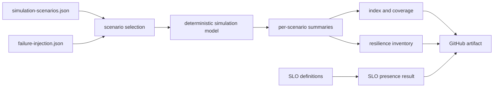

# System Simulation Workflow

System simulation validates the shape, ordering, coverage, and reproducibility
of Atlas lifecycle scenarios. It is a deterministic control-plane simulation.
It does not install a cluster, run the commands recorded in the scenario
registry, or inject faults into a live service.

That boundary matters. Simulation evidence can prove that lifecycle intent is
registered and encoded consistently. It cannot prove that an image starts, an
upgrade works, a rollback restores traffic, or an injected dependency failure
is contained.

## Workflow Path



The GitHub workflow runs `system simulate suite`, checks that the index,
coverage, and resilience reports exist, and uploads
`artifacts/system/simulation/` for 14 days. Concurrent runs on the same ref
cancel the older run.

## Scenario Selection

| Command | Selected scope |
| --- | --- |
| `system simulate install` | `fresh-install` |
| `system simulate upgrade` | `upgrade-previous-release` |
| `system simulate rollback` | `rollback-after-failed-upgrade` |
| `system simulate offline-mode` | `offline-mode` |
| `system simulate suite` | every registry scenario, sorted by durable scenario ID |

Run the complete model locally:

```bash
bijux-atlas-dev --repo-root "$PWD" system simulate suite --format json
```

The command writes governed run output under
`artifacts/system/simulation/`. Each scenario receives a machine-readable
summary, human summary, logs, rendered-manifest records, health checks, event
timeline, and evidence bundle. The root adds an index, coverage report,
resilience report, SLO validation, and dashboard.

## What the Current Model Measures

The simulation implementation creates deterministic evidence records. It uses
a fixed modeled duration of five seconds and compares that value with each
scenario's declared time budget. Registered injections are checked for catalog
membership. Evidence rows describe modeled logs, manifests, health checks, and
events.

The implementation does not execute the `command` field from the scenario
registry. It also does not apply the named injection to a process, filesystem,
network, cluster, or dependency. Therefore:

- `time_budget_ok` is a model assertion, not observed wall-clock performance;
- `supported: true` means the injection ID exists in the catalog, not that a
  fault occurred;
- 100% coverage means every selected registry row produced modeled output;
- a stable summary hash proves deterministic encoding for the same inputs;
- health-check and manifest rows are simulation fixtures, not live captures.

Use Kubernetes conformance, rollout-under-load, rollback drills, and
failure-injection runs for executed operational claims.

## Trigger Coverage

The workflow runs manually and on pull requests matching three paths:

- `configs/sources/operations/system/**`;
- `.github/workflows/system-simulation.yml`;
- `crates/bijux-atlas-dev/src/commands/system.rs`.

The third path does not exist in the current source tree. The implementation is
owned by `crates/bijux-atlas-dev/src/application/system.rs` and its CLI model is
under `src/interfaces/cli/`. Changes to those active paths do not automatically
trigger this workflow unless another listed path also changes. Run the manual
dispatch for such changes and treat the path-filter mismatch as a workflow
coverage defect until the trigger follows the active ownership paths.

## Reviewing a Result

Check the evidence in this order:

1. Registry and injection schema versions are accepted.
2. The selected scenario set matches the intended command.
3. Every selected scenario has an index entry and retained artifacts.
4. Unsupported injection references are absent.
5. Summary hashes are stable when the inputs are unchanged.
6. SLO validation points to the expected SLO definitions.
7. The claim made from the result stays inside the simulation boundary.

A missing artifact, unsupported injection, or unstable summary is a simulation
failure. A passing simulation is still not live-system evidence.

## Promotion Boundary

Use simulation to admit lifecycle definitions into broader validation. A
release decision must pair it with executed evidence appropriate to the claim:

| Claim | Additional evidence |
| --- | --- |
| image can start | install conformance and readiness transitions |
| upgrade preserves service | rendered diff, compatibility proof, and traffic-bearing upgrade |
| rollback restores service | exercised rollback with previous-release verification |
| offline mode works | disconnected install with pinned assets and denied egress |
| dependency failure is contained | confirmed fault injection under governed traffic |
| time budget is met | measured duration from the executed environment |

This separation keeps a useful deterministic model from being mistaken for an
integration or resilience result.
