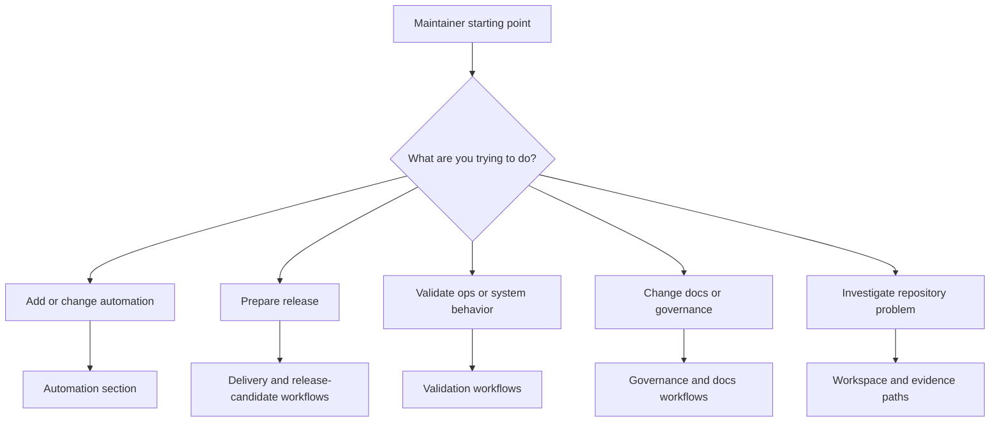

# Workflow Entrypoints

GitHub workflow entrypoints are grouped by concern so docs, ops, security, and
release lanes can be inspected deliberately. This page is the maintainer routing
guide for the question, "which repository workflow should I touch, read, or run
for the job in front of me?"

## Workflow Selection Model

This routing diagram exists so maintainers do not guess from workflow filenames alone. Atlas keeps
many workflows because they answer different repository questions, and good workflow ownership starts
by choosing the right decision path.

## Workflow Families

- automation changes usually start in the maintainer control plane and only then map to the owning CI workflow
- release preparation flows through `.github/workflows/release-candidate.yml`, `final-readiness.yml`, and the publish workflows
- ops and system validation flows through workflows such as `ops-validate.yml`, `system-simulation.yml`, and the load or security lanes
- docs and governance changes flow through docs validation, redirect, and governance checks
- repository investigation often starts with local control-plane commands and artifact inspection before escalating to CI workflow changes

## Repository Anchors

- [`.github/workflows`](/Users/bijan/bijux/bijux-atlas/.github/workflows) is the workflow root
- [`.github/required-status-checks.md`](/Users/bijan/bijux/bijux-atlas/.github/required-status-checks.md:1) records the required merge gates
- [`.github/CODEOWNERS`](/Users/bijan/bijux/bijux-atlas/.github/CODEOWNERS:1) records the review-routing boundaries around workflow changes
- [`.github/pull_request_template.md`](/Users/bijan/bijux/bijux-atlas/.github/pull_request_template.md:1) records the evidence a maintainer should attach when workflow behavior changes

## Practical Routing Rules

- if you are changing command behavior, start with the automation pages before editing a workflow file
- if you are proving a release candidate, start with the release-candidate and final-readiness workflows before touching publish automation
- if you are changing docs governance, inspect redirect, docs-build, and governance validation expectations together
- if you are debugging a failing workflow, identify the owned lane and the report artifact it is supposed to produce before changing the workflow logic

## Main Takeaway

Workflow entrypoints are not just a list of YAML files. They are the repository's named decision
paths for release, validation, docs governance, and operational proof, and maintainers should choose
them based on the question being answered rather than on which file looks closest.
