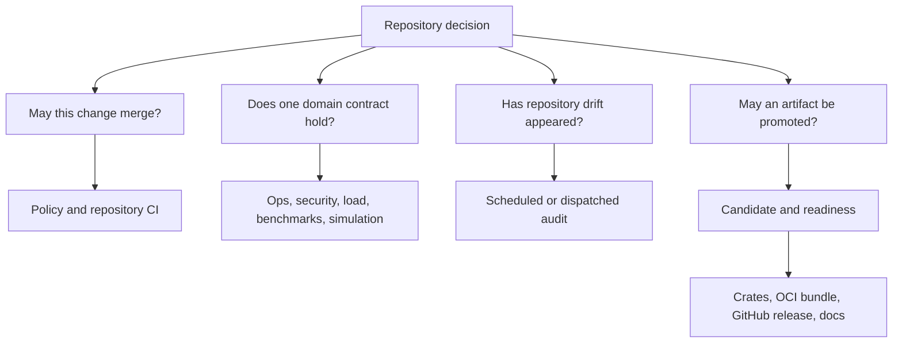
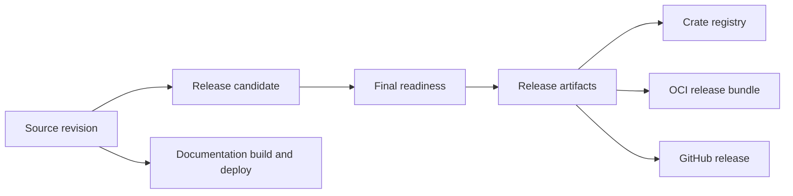

# Workflow Entrypoints

Atlas workflows encode distinct policy, validation, audit, and publication
decisions. Select a workflow by its trigger and claim, not by a similar filename
or the presence of a green check.

```mermaid
flowchart TD
    Need[Repository decision] --> Merge[May this change merge?]
    Need --> Domain[Does one domain contract hold?]
    Need --> Audit[Has repository drift appeared?]
    Need --> Release[May an artifact be promoted?]
    Merge --> Policy[Policy and repository CI]
    Domain --> Validation[Ops, security, load, benchmarks, simulation]
    Audit --> Scheduled[Scheduled or dispatched audit]
    Release --> Candidate[Candidate and readiness]
    Candidate --> Publish[Crates, OCI bundle, GitHub release, docs]
```

## Workflow Families

| Family | Principal workflows | Decision boundary |
| --- | --- | --- |
| merge policy | `policy / github`, `policy / pr approval`, `bijux-std`, `repo / ci` | branch rules, approval policy, shared standards, and repository checks are separate contexts |
| domain validation | `ops-validate`, security validation lanes, load and benchmark lanes, layering boundaries, system simulation | proves only the triggered paths, selected commands, fixtures, and targets |
| documentation | `docs-audit`, `deploy-docs` | audit is scheduled/manual; deployment is reusable/manual and has ref eligibility rules |
| release preparation | `release-candidate`, `final-readiness`, `release-artifacts`, compatibility matrix | assembles and evaluates release inputs without implying channel publication |
| publication | `release-crates`, `release-ghcr`, `release-github`, `deploy-docs` | each channel has its own credentials, identity, receipt, and failure boundary |
| reusable implementation | `reusable-ci-rust-stack`, reusable Python workflows | callable workflow implementation; not an independent repository decision unless invoked |

## Route a Change

1. Identify the observed surface and its owner.
2. Read the workflow's `on` block to confirm the event and path filter.
3. Follow delegated Make and `bijux-atlas-dev` commands to the executable
   authority.
4. Check permissions, environment, external targets, and capability flags.
5. Locate reports and uploads, including behavior under failure.
6. Compare the resulting context with the checked-in branch-protection list.

Workflow filenames are not status-check identities. GitHub uses workflow and
job names for contexts, and `.github/required-status-checks.md` currently lists
only the universal policy and shared-standard baseline. A domain lane can be
important evidence without being a required branch-protection context.

## Publication Sequence

```mermaid
flowchart LR
    Revision[Source revision] --> Candidate[Release candidate]
    Candidate --> Ready[Final readiness]
    Ready --> Artifacts[Release artifacts]
    Artifacts --> Crates[Crate registry]
    Artifacts --> OCI[OCI release bundle]
    Artifacts --> GitHub[GitHub release]
    Revision --> Docs[Documentation build and deploy]
```

The arrows represent intended decision order, not one atomic transaction. A
successful publication to one channel does not prove success or rollback on
another. Retain channel-specific receipts and reconcile partial publication.

## Stability

Trigger filters, workflow/job names, delegated commands, permissions, report
paths, and publication identities are reviewable contract surfaces. Reusable or
standards-synchronized workflows must be changed at their owning source rather
than patched locally.
