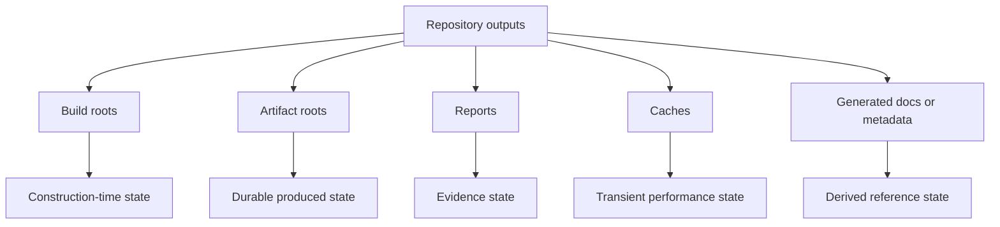

# Artifact Roots

Maintainer workflows write governed outputs under repository artifact roots so
evidence and generated assets stay reviewable.

## Artifact Root Model

This distinction matters because Atlas does not treat every file written during local or CI work the
same way. Some outputs are evidence, some are caches, and some are generated references that must be
reviewed as derived artifacts rather than edited as source.

## Canonical Roots

- `artifacts/` is the main reviewable root for generated reports, summaries, and workflow outputs
- `artifacts/isolates/` is used by CI lanes to keep cache, temp, and run state scoped to a named lane
- `target/` and cargo cache roots are build-time state, not published evidence
- committed example outputs under `ops/_generated.example/` are governed examples, not a dumping ground for live runtime artifacts

## Why Root Discipline Matters

- it makes cleanup predictable
- it keeps evidence paths stable across local and CI runs
- it prevents hidden scratch output from becoming accidental source of truth
- it helps reviewers understand which files are durable proof and which are disposable execution state

## Repository Anchors

- [`configs/sources/repository/repo-laws.json`](/Users/bijan/bijux/bijux-atlas/configs/sources/repository/repo-laws.json:1) declares that tracked source excludes runtime artifacts outside governed examples
- [`.github/workflows/release-candidate.yml`](/Users/bijan/bijux/bijux-atlas/.github/workflows/release-candidate.yml:1) shows lane-specific artifact and isolate roots in practice
- [`.github/workflows/ops-validate.yml`](/Users/bijan/bijux/bijux-atlas/.github/workflows/ops-validate.yml:1) shows the same discipline for ops validation

## Main Takeaway

Artifact roots are part of repository governance. When maintainers keep outputs in the right root,
Atlas stays reproducible, reviewable, and honest about what is source, what is proof, and what is
just temporary execution state.
