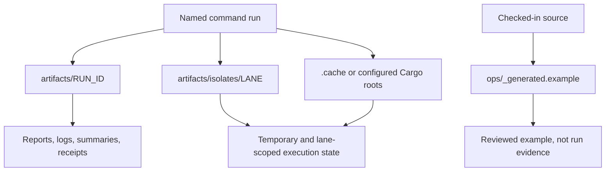

# Artifact Roots

Atlas keeps generated reports, run products, caches, and examples in distinct
roots because they carry different trust and retention properties. A path under
`artifacts/` is discoverable output, but the path alone does not make it valid
evidence.

```mermaid
flowchart TD
    Run[Named command run] --> Evidence[artifacts/RUN_ID]
    Run --> Isolate[artifacts/isolates/LANE]
    Run --> Cache[.cache or configured Cargo roots]
    Source[Checked-in source] --> Example[ops/_generated.example]
    Evidence --> Retain[Reports, logs, summaries, receipts]
    Isolate --> Dispose[Temporary and lane-scoped execution state]
    Cache --> Dispose
    Example --> Fixture[Reviewed example, not run evidence]
```

## Root Semantics

| Root | Intended contents | Trust rule |
| --- | --- | --- |
| `artifacts/<run-id>/` | reports and receipts for one run | bind claims to run, revision, command, and target |
| `artifacts/isolates/<lane>/` | temporary lane and Cargo state | disposable; cache presence is not run proof |
| `.cache/` or an explicitly configured Cargo root | compiler and dependency caches | performance optimization only |
| `artifacts/docs/site/` | built documentation site | publication input; verify its build separately |
| `ops/_generated.example/` | checked-in example output | fixture, never live run evidence |

Workflows do not use one universal Cargo cache location. For example,
`ops-validate` places Cargo state beneath its isolate, while
`release-candidate` uses `.cache/cargo/target/release-candidate` and keeps run
reports under `artifacts/<run-id>/`. Consumers must use the paths declared by
the executing lane rather than infer evidence from a generic directory name.

## Run Identity

A reviewable run root contains enough context to answer:

- which command and revision produced the files;
- which profile, selector, or suite was chosen;
- which capabilities and external targets were used;
- which report is authoritative and which files are supporting logs;
- whether the workflow uploaded the complete root and how long it is retained.

The release-candidate and ops-validation workflows create a unique `RUN_ID`,
write reports and logs under that root, summarize key paths, and upload the run
directory. Individual commands can also write domain-specific paths elsewhere
under `artifacts/`; workflow capture must make those paths explicit.

## Retention and Promotion

Moving a file from disposable output into a governed location changes its
contract. Make that transition only when a registry names the destination,
producer, source inputs, validation command, and consumer. Preserve the
generated header or schema identity required by that registry.

| Lifecycle action | Required evidence |
| --- | --- |
| retain a run | run identity, revision, command, inputs, result, and artifact manifest |
| upload from CI | workflow and job identity, retention period, complete root, and checksum or platform receipt |
| compare with a baseline | scenario identity, environment class, metric semantics, and compatibility decision |
| publish as release evidence | artifact identity, provenance, checksum binding, and consumer verification |
| promote into a governed source location | owning registry, deterministic generator, freshness check, and review |

Copying a report into a release packet does not strengthen the report. The
packet must preserve its status, scope, input identity, and evidence gaps.

## Repository Boundary

`configs/sources/repository/repo-laws.json` declares runtime artifacts
ephemeral outside governed examples. Generated output is committed only when a
registry or source contract names the governed destination. Otherwise it stays
untracked and disposable.

## Path Compatibility

Report paths named by workflows, registries, or consumer automation are
compatibility surfaces. Cache and temporary paths are not, unless a checked-in
consumer incorrectly promotes them into a contract. Change a governed path
with its producers and consumers; do not retain an obsolete location by
silently duplicating outputs.
