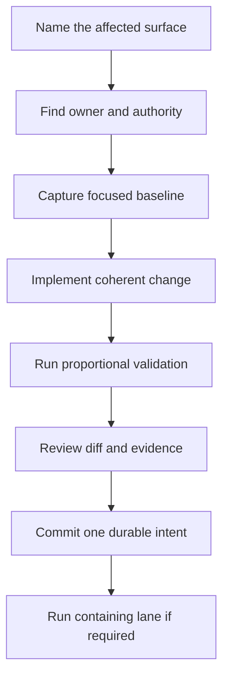

# Contributor Workflow

A reviewable Atlas change connects intent, ownership, contract impact, and
reproducible evidence. The workflow begins with the affected surface, not with
a universal setup or test command.

## From Change to Review



### Name the affected surface

State whether the change affects product behavior, a public contract,
operations, maintainer automation, documentation, or generated evidence. A
single patch can affect more than one surface; each one needs an owner and proof.

### Find the authority

Use code for behavior, schemas and registries for governed shapes, generated
references for observed surfaces, and docs for reader workflows. If they
disagree, record the discrepancy. Do not silently choose the version that makes
the change easiest.

### Capture a focused baseline

Run or inspect the narrow check that can fail for the intended change. For a
docs edit, validate docs. For a schema edit, validate that schema and a governed
example. For a command edit, compare the command tree, command registry, output
schema, and consuming wrapper.

### Implement a coherent change

Keep unrelated work out of the diff. Update public docs and examples when the
behavior they teach changes. Update generated output only through its owning
generator, and keep generated changes distinct when they have separate review
value.

## Evidence by Change Type

| Change | Minimum focused evidence | Broader evidence when warranted |
| --- | --- | --- |
| docs prose or navigation | `docs validate`, Markdown diff check, and link/nav validation owned by the docs command. | docs build or UX smoke when rendering, theme, includes, or generated references change. |
| one Rust crate | selected package test or named test target. | dependent packages or the containing suite when public behavior crosses crates. |
| CLI surface | help/output snapshot, registry agreement, and command-specific test. | compatibility and pull-request lanes for public names or output changes. |
| JSON Schema or report | exact schema validation against governed examples and producer output. | compatibility report and all known consumers for a breaking or versioned change. |
| runtime configuration | effective-config validation with exact candidate inputs. | deployment profile, security, and startup tests for cross-field or production rules. |
| operations profile | render and validate the named profile. | scenario, load, or rollback evidence for behavior under runtime conditions. |

The minimum is a starting point, not a waiver. Risk, ownership boundaries, and
consumer count determine how far validation must expand.

## Review the Change Before Committing

Inspect both unstaged and staged diffs. Confirm that the commit contains one
durable intent, no incidental artifacts, no unrelated user work, and no claim
stronger than the retained evidence.

Useful checks include:

```bash
git diff --check
git diff --name-only
git diff --cached --check
git diff --cached --name-only
```

Stage explicit paths. Commit only after the focused evidence for that unit is
known. If a required check is intentionally deferred because it is slow,
networked, or environment-specific, name it and do not imply that it passed.

## Review Handoff

A reviewer should be able to answer:

- What user, operator, or maintainer outcome changed?
- Which authority owns the changed surface?
- Is the change compatible, versioned, or intentionally breaking?
- Which exact commands ran, and what did each prove?
- Which checks were not run, and why?
- Where is the retained report when the decision depends on an artifact?
- What known discrepancy or risk remains?

One copy-paste rerun command is valuable only when it selects the same scope and
capabilities as the reported evidence.

## When Validation Disagrees

If focused validation passes and a containing lane fails, preserve both results.
Inspect the lane's selected IDs and failure artifacts before expanding again.
If local behavior and CI differ, compare binary version, registry revision,
environment, capability grants, and artifact roots.

Do not weaken a check, broaden an allowlist, or edit generated evidence to make
the disagreement disappear. Resolve the owning contract or report the blocker.

Continue with [Testing and Evidence](../governance/testing-and-evidence.md) for
proof strength and [Change and
Compatibility](../governance/change-and-compatibility.md) for public evolution.
