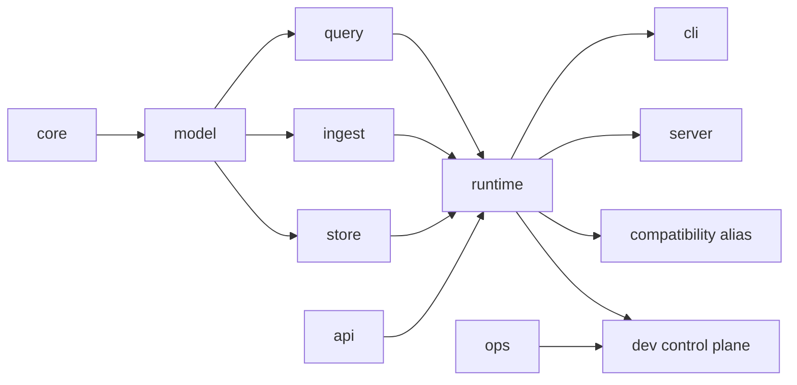

# Crate Boundary Review

Atlas separates stable values, domain behavior, composition, executable hosts,
operations models, compatibility, and repository automation. The split is an
ownership system: each public behavior should have one crate where a maintainer
can find its implementation, contract, and focused evidence.

## Workspace Map

The graph describes responsibility, not every Cargo edge. Shared primitives
should move downward only when they are genuinely runtime-independent. A host
must remain thin enough that product semantics stay testable without spawning
the executable.

## Ownership by Crate

| Crate | Durable responsibility | Boundary violation |
| --- | --- | --- |
| `bijux-atlas-core` | runtime-independent primitives and invariants | importing HTTP, CLI, repository, or deployment behavior |
| `bijux-atlas-model` | stable dataset and contract values | owning orchestration or external effects |
| `bijux-atlas-query` | parsing, planning, cursoring, and query execution | depending on server routing or terminal presentation |
| `bijux-atlas-ingest` | source normalization and artifact construction | publishing catalogs or serving HTTP requests |
| `bijux-atlas-store` | immutable publication and storage contracts | owning query semantics or deployment policy |
| `bijux-atlas-api` | DTOs, error envelopes, and OpenAPI ownership | embedding server lifecycle or store implementation |
| `bijux-atlas-runtime` | canonical composition of product workflows | becoming an executable-specific UI host |
| `bijux-atlas-cli` | installed end-user command and terminal adaptation | reimplementing ingest or query behavior |
| `bijux-atlas-server` | HTTP host, routing, middleware, and process lifecycle | moving reusable domain semantics into route handlers |
| `bijux-atlas` | compatibility import path | creating behavior that differs from canonical owners |
| `bijux-atlas-ops` | reusable stack, Kubernetes, load, observability, and release models | owning repository-only orchestration or product runtime behavior |
| `bijux-atlas-dev` | repository checks, execution control, and evidence | duplicating published product or operations semantics |

## Place a Change

Start from the invariant being changed:

1. Put stable values and validation with their domain owner.
2. Put reusable orchestration in `bijux-atlas-runtime`, not in a host.
3. Keep CLI and server code responsible for transport, process, and
   presentation adaptation.
4. Put reusable operational contracts in `bijux-atlas-ops`; keep repository
   selection, effects, and reporting in `bijux-atlas-dev`.
5. Extend the compatibility alias only by re-exporting canonical behavior.

If two crates must implement the same decision, the ownership boundary is
wrong. Extract one lower contract or expose one owner through a public adapter.

## Evidence for a Boundary Change

| Evidence | Question answered |
| --- | --- |
| dependency-direction test | does the source graph preserve allowed ownership? |
| owner-focused unit or contract test | does the canonical implementation preserve behavior? |
| host integration test | does CLI or HTTP adaptation retain the contract? |
| public API and compatibility review | did an observed import, command, route, schema, or error change? |
| maintainer route parity | does automation invoke the same canonical behavior rather than a copy? |

The current split crates exist and own active product surfaces; they are not a
future extraction plan. Review should focus on preventing semantic drift back
into hosts and automation, and on keeping published boundaries explicit as the
system grows.

See [Runtime Ownership Boundary](runtime-ownership-boundary.md) for the strict
maintainer/product direction and the product
[Crate Boundary Contract](../../bijux-atlas/foundations/crate-boundary-contract.md)
for consumer-facing guarantees.
