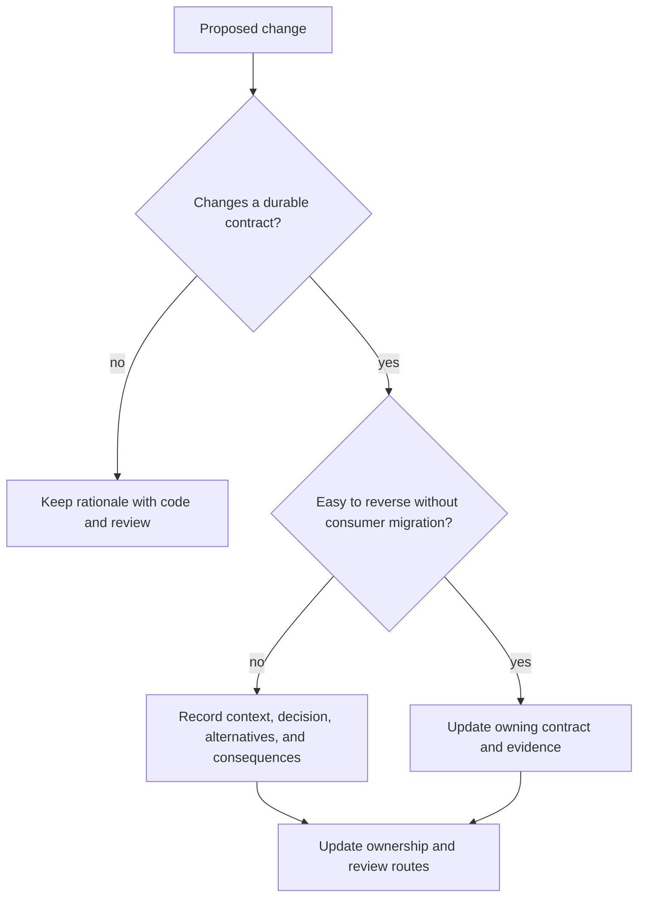

# Decision Records and Ownership

Atlas stays reviewable when the authority that makes a decision, the reviewers
responsible for it, and the record explaining a durable trade-off are all
discoverable. These are related signals, not substitutes for one another.

## Decision Classes



An ADR is appropriate when future maintainers must understand why a costly or
cross-domain choice was made. It is unnecessary for routine implementation
details that remain obvious from the owning contract and tests.

## Ownership Signals

Atlas exposes several ownership signals:

| Signal | Answers | Does not prove |
| --- | --- | --- |
| page `owner` metadata | who maintains the narrative surface | GitHub approval or runtime ownership |
| registry and schema ownership | who governs a machine-readable contract | that generated consumers are current |
| runnable and report metadata | who owns automation identity and evidence | that a named run executed successfully |
| `.github/CODEOWNERS` | who GitHub requests for review | expertise, approval, or enforcement outside GitHub |
| ADR metadata | who accepted a durable architectural decision | that the implementation still matches the decision |

If those signals disagree, resolve the ownership drift before merging the change.

When signals disagree, stop treating ownership as resolved. Find the authority
that makes the affected decision, correct stale routes in the same change, and
record intentional exceptions explicitly.

## Governance Rules

Atlas governance stays honest when one checked-in source owns each durable rule.

- public behavior belongs in canonical docs and contracts, not ad hoc notes;
- generated evidence points back to the checked-in source that defines it;
- ownership changes update the owning registry, metadata, and review route in
  the same coherent change;
- ADRs explain decisions but do not become alternate configuration or policy
  authorities.

## ADR Template

Use this minimum structure when a decision needs durable recordkeeping:

```md
# ADR-NNNN: <clear decision title>

Status: <proposed | accepted | superseded>
Date: YYYY-MM-DD
Owners: <durable owner identifiers>

## Context

## Decision

## Alternatives Considered

## Consequences

## Owning Contracts and Evidence
```

## When to Record a Decision

Capture a durable decision record when you:

- change a contract, schema, or compatibility promise.
- move a boundary between crates, domains, docs, configs, or ops.
- introduce a new canonical automation surface or retire an old one.
- change a workflow that other contributors will need to repeat.
- accept a security, reliability, data-integrity, or operational trade-off that
  is not obvious from the resulting code.

## Practical Commands

```bash
cargo run -q -p bijux-atlas-dev -- governance adr index --format json
cargo run -q -p bijux-atlas-dev -- governance list --format json
cargo run -q -p bijux-atlas-dev -- governance doctor --format json
```

`governance adr index` indexes the checked-in ADR set and can write its report
under `artifacts/governance/`. It does not create an ADR, decide whether one is
needed, validate the implementation against the decision, or reconcile owner
metadata automatically. `governance list` and `governance doctor` cover broader
governance inventory and diagnostics; read their findings at their stated
scope.

## Maintainer Rule

Never rely on “the owner probably knows” or “the context is in the PR” as the
only governance mechanism. If future readers need the decision to understand
why the repository is shaped this way, record it in a canonical file and link
the owning contracts.

## A Good Ownership Check

- can you point to the authority that makes the decision?
- do registry, documentation, automation, and review routing name compatible
  owners?
- can a future maintainer find the rationale without reconstructing chat or
  pull-request history?
- does focused evidence show the implementation still honors the accepted
  decision?
