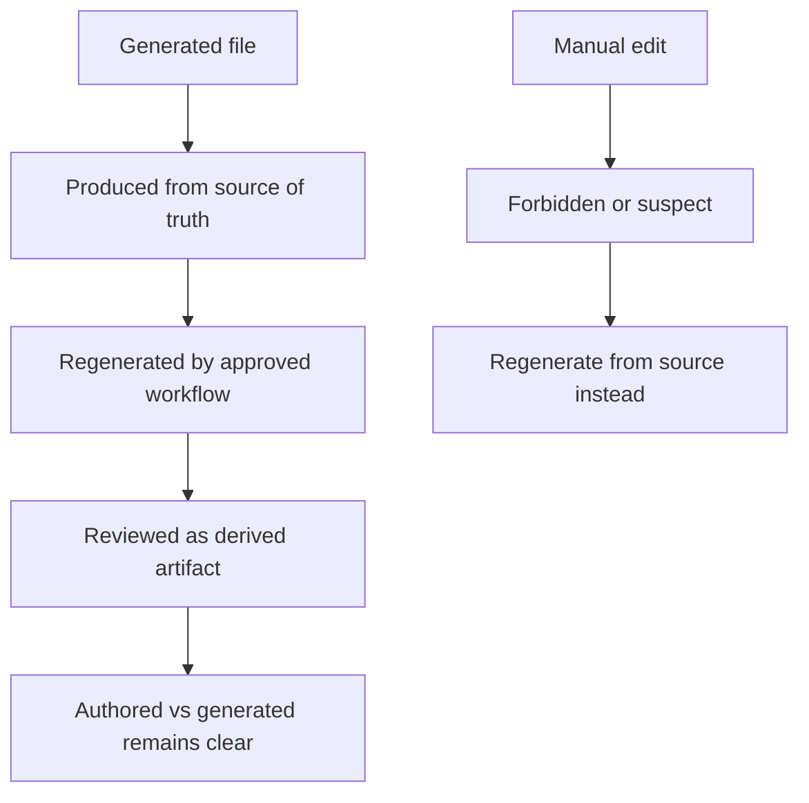

# Generated Files

Generated files are tracked with explicit generators and freshness policies.

## Generated File Model

This model exists to keep maintainers from quietly hand-editing derived outputs and then forgetting
which command is supposed to recreate them.

## Source Anchors

- [`configs/sources/repository/docs/generated-files-registry.json`](/Users/bijan/bijux/bijux-atlas/configs/sources/repository/docs/generated-files-registry.json:1)
- [`configs/sources/repository/docs/generated-files-freshness-policy.json`](/Users/bijan/bijux/bijux-atlas/configs/sources/repository/docs/generated-files-freshness-policy.json:1)

## What The Registry Records

The registry ties each tracked generated docs artifact to the exact generator command, for example:

- examples pages generated by `bijux-dev-atlas docs generate examples --allow-write`
- command lists generated by `bijux-dev-atlas docs generate command-lists --allow-write --allow-subprocess`
- schema, OpenAPI, ops, and real-data pages generated by explicit `bijux-dev-atlas docs generate ...` commands
- compatibility matrices generated by the release compatibility command path

## Freshness Rules

The freshness policy currently defines:

- `max_age_days: 30`
- a required header prefix of `<!-- Generated by:`
- `BIJUX_DOCS_FRESHNESS_DATE` as the reference clock environment variable

That means generated docs are not only reproducible; they are also expected to disclose their
generator and remain visibly fresh enough to trust.

## Maintainer Rules

- do not manually edit a tracked generated file to fix content drift
- update the authored source or generator, then regenerate
- review generated diffs as outputs of a command, not as independent prose decisions
- keep the registry and freshness policy aligned with any new generated artifact you decide to track

## Main Takeaway

Generated files are part of Atlas documentation governance. They are welcome in the repository only
when their generator, freshness expectation, and review model are explicit enough that another
maintainer can reproduce them later.
