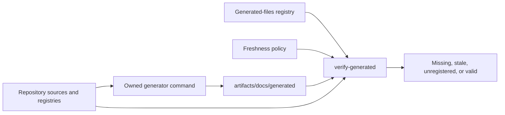

# Generated Files

Atlas treats generated documentation as reproducible run output. The generated
files live under `artifacts/docs/generated/`; their registry and freshness
policy live under `configs/sources/repository/docs/`. The distinction matters:
the configuration is authored authority, while the generated content is a
derived artifact that can be recreated.


```mermaid
flowchart LR
    Authority[Repository sources and registries] --> Generator[Owned generator command]
    Generator --> Output[artifacts/docs/generated]
    Registry[Generated-files registry] --> Verify[verify-generated]
    Policy[Freshness policy] --> Verify
    Output --> Verify
    Authority --> Verify
    Verify --> Result[Missing, stale, unregistered, or valid]
```

## Governed Outputs

The generated-files registry contains 11 entries. They cover examples, command
lists, schema and OpenAPI snippets, operations snippets, real-data summaries,
an artifact-link inventory, and operations compatibility matrices. Every row
binds a repository-relative output path to the command that owns it.

Generators declare their effects explicitly. Content-only generators require
`--allow-write`; command-list generation also requires `--allow-subprocess`.
The compatibility matrix is owned by the release command family rather than
the docs generator.

## Verify Before Regenerating

```bash
bijux-atlas-dev docs verify-generated --repo-root . --format json
```

The verifier independently reconstructs its expected output set and reports:

- missing generated files;
- Markdown files without the generated header;
- content that differs from freshly rendered output;
- expected paths missing from the registry;
- unexpected registry paths; and
- files older than the configured maximum age.

JSON outputs are compared structurally; other outputs are compared byte for
byte. The current freshness maximum is 30 days and is evaluated from filesystem
modification time.

## Current Policy Boundary

The freshness policy also declares `required_header_prefix` and
`reference_clock_env`. The current verifier does not read either field: it uses
the generator's built-in header and the system clock. Setting
`BIJUX_DOCS_FRESHNESS_DATE` therefore does not make verification deterministic
today. Treat those two fields as declared future-facing policy until the
verifier consumes them.

Two real-data overview files are permitted as registry-only paths because they
are not part of the verifier's primary reconstructed set. This is an explicit
exception in the implementation, not a general allowance for unverified
generated files.

## Safe Change Workflow

1. Change the authored source or generator.
2. Run the owning generator with only its required capabilities.
3. Run `docs verify-generated` and inspect every result array, not only status.
4. Review generated diffs together with their source change.
5. When adding an output, update the registry and the verifier's expected set
   in the same change unless the output has a documented exception.

Do not repair drift by editing a generated output directly. A direct edit may
look correct until the next regeneration, but it leaves the source of truth
wrong and breaks reproducibility.
