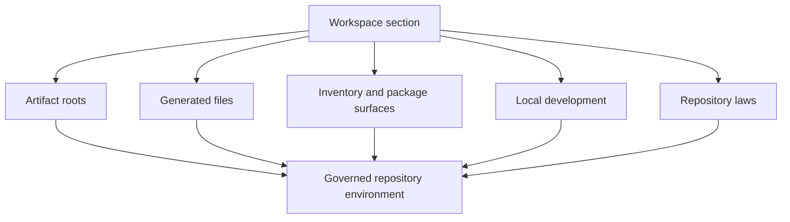

# Workspace

`bijux-atlas-dev/workspace` is the section home for this handbook slice.

Workspace pages explain the repository as a physical system, not just as an
abstract codebase. They should help maintainers understand where things belong,
which files are authored versus generated, how tooling interacts with structure,
and what repository laws protect long-term clarity.

## Workspace Scope

- output and artifact layout
- contributor and maintainer starting paths
- generated versus authored file discipline
- inventory registries, package surfaces, and repository law

## Pages

- [Artifact Roots](artifact-roots.md)
- [Contributor Workflow](contributor-workflow.md)
- [Decision Records and Ownership](decision-records-and-ownership.md)
- [Generated Files](generated-files.md)
- [Inventory Registry](inventory-registry.md)
- [Local Development](local-development.md)
- [Maintainer Entrypoints](maintainer-entrypoints.md)
- [Package Surface](package-surface.md)
- [Repository Laws](repository-laws.md)
- [Workspace and Tooling](workspace-and-tooling.md)
