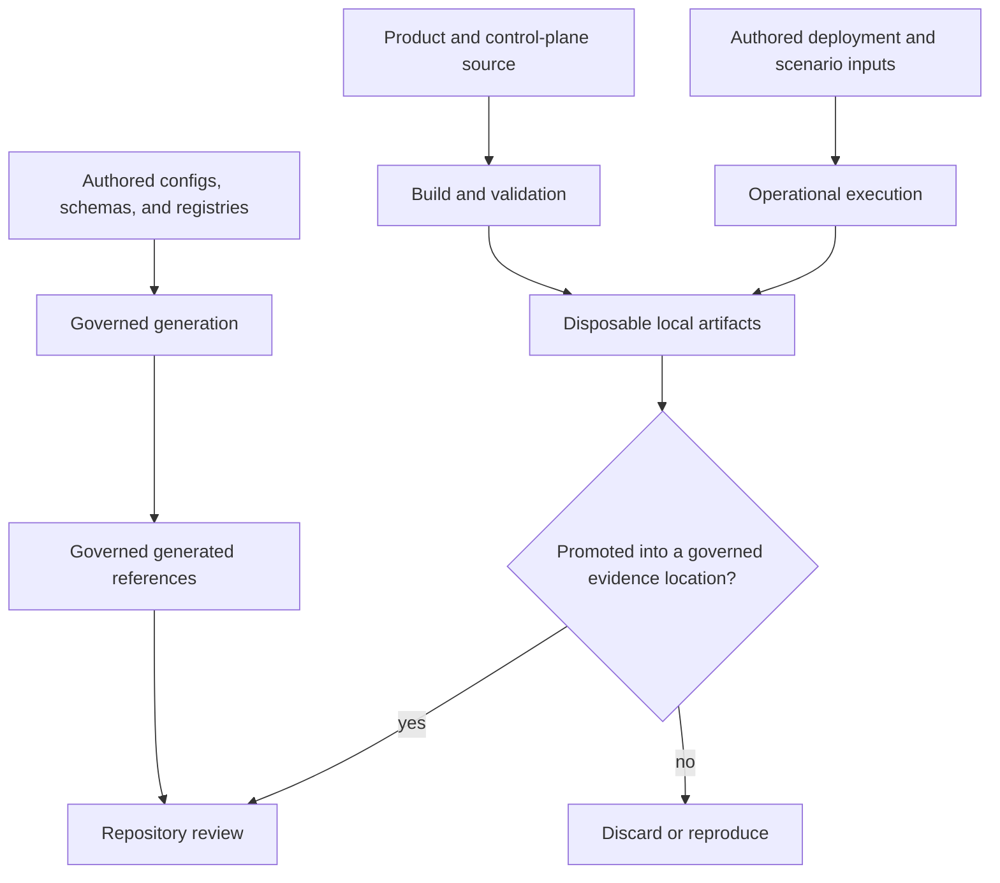

# Workspace

The Atlas repository separates authored contracts, product implementation,
generated references, operational inputs, and disposable run output. That
separation determines what may be edited, what must be regenerated, and what
can support a release claim.

```mermaid
flowchart TD
    Contracts[Authored configs, schemas, and registries] --> Generate[Governed generation]
    Product[Product and control-plane source] --> Build[Build and validation]
    Ops[Authored deployment and scenario inputs] --> Execute[Operational execution]
    Generate --> Governed[Governed generated references]
    Build --> Artifacts[Disposable local artifacts]
    Execute --> Artifacts
    Governed --> Review[Repository review]
    Artifacts --> Evidence{Promoted into a governed evidence location?}
    Evidence -->|yes| Review
    Evidence -->|no| Dispose[Discard or reproduce]
```

## Repository Authorities

| Path | Ownership | Change rule |
| --- | --- | --- |
| `crates/` | product, operations-contract, and maintainer implementations | change the narrowest owning crate and preserve dependency direction |
| `configs/` | schemas, policies, registries, examples, and governed references | edit authored inputs; regenerate managed outputs through their owner |
| `ops/` | deployment, observability, load, resilience, and release contracts | bind changes to the affected profile, scenario, or evidence family |
| `docs/` | public product, operator, and maintainer handbooks | write for the reader and validate navigation, links, and contract claims |
| `makes/` | thin command aliases | keep orchestration in Rust control-plane commands |
| `artifacts/` | local outputs, reports, caches, and run products | treat as disposable unless a governed workflow promotes an output |

Generated files are not a second authoring surface. Their provenance must lead
to an authored source and a reproducible generator. A manual edit that cannot
survive regeneration is not a durable repository change.

## Route by Change

| Change | Read before editing |
| --- | --- |
| local setup or command discovery | [Local Development](local-development.md) and [Maintainer Entrypoints](maintainer-entrypoints.md) |
| crate ownership or dependency direction | [Package Surface](package-surface.md), [Crate Boundary Status](crate-boundary-status.md), and [Runtime Ownership Boundary](runtime-ownership-boundary.md) |
| generated or checked-in derived content | [Generated Files](generated-files.md) and [Inventory Registry](inventory-registry.md) |
| local outputs or retained evidence | [Artifact Roots](artifact-roots.md) |
| cross-cutting ownership decision | [Decision Records and Ownership](decision-records-and-ownership.md) |
| repository invariant | [Repository Laws](repository-laws.md) |
| normal contribution | [Contributor Workflow](contributor-workflow.md) and [Workspace and Tooling](workspace-and-tooling.md) |

## Integrity Rules

- A repository path has one durable owner even when several workflows consume it.
- Authored inputs and generated outputs are reviewed as different change types.
- Local execution writes disposable output under `artifacts/` unless the
  workflow owns another governed destination.
- A report is evidence only for the source, inputs, capabilities, and run
  identity it records.
- Runtime code must not depend on repository-only maintainer automation.
- A clean worktree and reproducible generation are part of reviewability, not
  cosmetic preferences.
