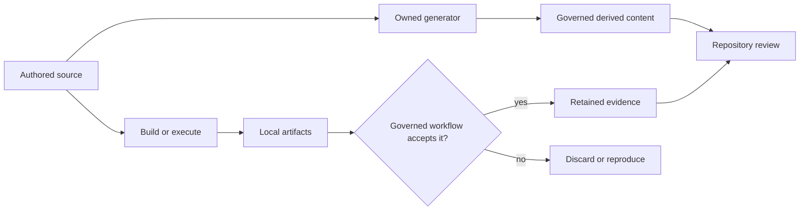

# Workspace

The repository separates authored authority, governed derived content, and
disposable run output. That distinction determines what can be edited, what
must be regenerated, and what can support a review or release decision.

```mermaid
flowchart LR
    Authored[Authored source] --> Generate[Owned generator]
    Generate --> Governed[Governed derived content]
    Authored --> Execute[Build or execute]
    Execute --> Local[Local artifacts]
    Governed --> Review[Repository review]
    Local --> Promote{Governed workflow accepts it?}
    Promote -->|yes| Evidence[Retained evidence]
    Promote -->|no| Dispose[Discard or reproduce]
    Evidence --> Review
```

## Repository authorities

| Path | Owns | Change rule |
| --- | --- | --- |
| `crates/` | Product, operations-library, and maintainer implementations | Change the narrowest owning crate and preserve dependency direction |
| `configs/` | Schemas, policies, registries, examples, and governed references | Edit authored inputs; regenerate managed consumers through their owner |
| `ops/` | Deployment, observability, load, resilience, and release contracts | Bind a change to its profile, scenario, or evidence family |
| `docs/` | Public product, operator, and maintainer handbooks | Write for the reader and verify navigation, links, and claims |
| `makes/` | Thin command aliases | Keep durable orchestration in typed control-plane commands |
| `artifacts/` | Local reports, caches, and run products | Treat output as disposable until a governed workflow promotes it |

Generated files are not a second authoring surface. Their provenance must lead
to an authored source and reproducible generator. A manual edit that disappears
on regeneration is not a durable change.

## Route by change

| Change | Read before editing |
| --- | --- |
| setup or command discovery | [Local Development](local-development.md) and [Maintainer Entrypoints](maintainer-entrypoints.md) |
| crate boundaries | [Package Surface](package-surface.md), [Boundary Review](crate-boundary-review.md), and [Runtime Ownership](runtime-ownership-boundary.md) |
| generated content | [Generated Files](generated-files.md) and [Inventory Registry](inventory-registry.md) |
| local output or retained evidence | [Artifact Roots](artifact-roots.md) |
| cross-cutting ownership | [Decision Records and Ownership](decision-records-and-ownership.md) |
| repository invariant | [Repository Laws](repository-laws.md) |
| contribution flow | [Contributor Workflow](contributor-workflow.md) and [Workspace and Tooling](workspace-and-tooling.md) |

One path has one durable owner even when many workflows consume it. A report is
evidence only for the source, inputs, capabilities, and run identity it records.
A clean worktree and reproducible generation make that ownership reviewable.
