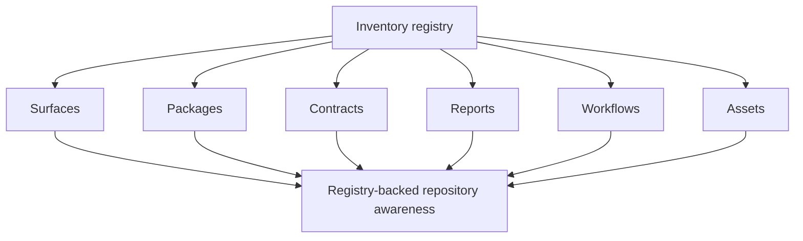

# Inventory Registry

The inventory registry under `ops/inventory/registry.toml` turns checks and
surface claims into auditable data.

## Inventory Model

The purpose of this page is to help maintainers see inventory as repository memory, not as another
incidental metadata file. Atlas uses inventories so claims about checks, surfaces, and authorities
can be inspected and validated later.

## Source Anchor

- [`ops/inventory/registry.toml`](/Users/bijan/bijux/bijux-atlas/ops/inventory/registry.toml:1)

## What Lives In The Registry

The current registry records governed checks with fields such as:

- `id`
- `domain`
- `title`
- `docs`
- `tags`
- `suites`
- `effects_required`
- `budget_ms`
- `visibility`

That structure means a check is not only runnable code. It is also a named surface with a docs
anchor, runtime classification, and suite placement.

## Why Maintainers Should Care

- inventory-backed surfaces are easier to audit than hidden assumptions in scripts
- docs can point to named checks and suites instead of fuzzy descriptions
- governance can validate drift between declared surfaces and the live repository
- release, docs, and ops work all benefit from the same shared registry vocabulary

## Main Takeaway

The inventory registry is how Atlas turns repository self-knowledge into data. When a maintainer
adds or changes a governed surface, updating the registry is part of making that change legible to
the rest of the system.
