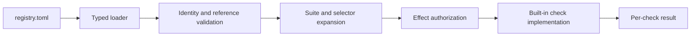

# Inventory Registry

`ops/inventory/registry.toml` is the executable catalog for Atlas development
checks and suites. It is not the inventory for every operations asset; the
surrounding `ops/inventory/` directory contains separate authorities for
contracts, ownership, layers, gates, surfaces, policies, pins, and stack data.

The current registry declares 124 checks and 21 suites. Of those checks, 22 are
public and 102 are internal.


```mermaid
flowchart LR
    Registry[registry.toml] --> Parse[Typed loader]
    Parse --> Validate[Identity and reference validation]
    Validate --> Select[Suite and selector expansion]
    Select --> Capability[Effect authorization]
    Capability --> Runner[Built-in check implementation]
    Runner --> Evidence[Per-check result]
```

## Check Contract

Every check row declares its ID, domain, title, documentation path, tags, suite
memberships, required effects, time budget, and visibility. Owner, severity,
mode, rationale, fix hint, and evidence paths may be explicit; the loader fills
documented defaults when they are omitted.

That distinction affects review. A value visible from `check explain` may be a
loader default rather than text authored in `registry.toml`. Consumers should
rely on the loaded check model for execution and on the source row when
reviewing whether an intent was explicitly declared.

Effects also determine the default mode: checks needing only `fs_read` are
static; any other effect makes the inferred mode effectful. Execution refuses
missing capabilities rather than silently granting them.

## Suite Contract

A suite can select checks by explicit IDs, domains, and tags. Expansion is a
union of explicit matches and filter matches, deduplicated and ordered by check
ID. Selecting a suite still applies visibility, slow-check, domain, severity,
mode, tag, title, and ID selectors from the invocation.

Internal checks and checks tagged `slow` are excluded unless explicitly
included. A suite name alone therefore does not describe the complete executed
set; the invocation and selected IDs belong in the evidence.

## Registry Validation

The loader rejects malformed domains, effects, visibility, modes, severities,
tags, check IDs, and suite IDs. It also rejects duplicate check identities,
duplicate normalized titles, zero budgets, empty required effects, unknown
suite members, and tags outside the declared vocabulary.

The registry doctor adds two checks that ordinary loading does not:

- checks and suites must be sorted by ID; and
- every registered check must have exactly one built-in implementation, with no
  unregistered built-in checks.

Some repository checks validate additional relationships, including docs paths
for required suites. The core loader itself stores a docs path as a string and
does not verify that every referenced page exists.

## Inspect the Catalog

```bash
bijux-atlas-dev check list \
  --repo-root . \
  --include-internal \
  --include-slow \
  --format json
bijux-atlas-dev check explain checks_repo_law_metadata_complete_and_unique \
  --repo-root . \
  --format json
bijux-atlas-dev check doctor --repo-root . --format json
```

Use the stable check ID as the automation identity. Titles and terminal layout
are for people; suite expansion, effect declarations, structured results, and
exit status determine what a run actually established.
