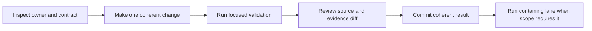

# Local Development

Local Atlas work should produce the smallest credible proof for the surface
being changed. Run from the repository root, or pass `--repo-root` explicitly
to the development control plane. Keep generated state under `artifacts/` so a
run cannot blur source, fixtures, and disposable evidence.

## Establish the Boundary

Before editing, identify four things:

| Question | Where to look |
| --- | --- |
| Which crate or docs area owns the behavior? | package README, docs section index, and ownership registries. |
| Which contract defines the public shape? | schema, command registry, OpenAPI, configuration contract, or manifest. |
| Which focused check protects it? | `bijux dev atlas check list` with domain, tag, or name filters. |
| Which broader lane contains that check? | check registry suite membership or executable suite description. |

```bash
bijux dev atlas check list --domain docs --format json
bijux dev atlas check list --tag config --format json
bijux dev atlas suites list --format json
```

Do this before choosing a test command. A large workspace command can consume
time while still missing the contract that actually changed.

## Focused Development Loop



For documentation-only work, a focused loop can be:

```bash
bijux dev atlas docs validate --format json
git diff --check
git diff -- docs/
```

For one registered repository rule:

```bash
bijux dev atlas check explain <check-id> --format json
bijux dev atlas check run --id <check-id> --format json
```

For one Rust package, use package selection and the smallest relevant test
target. Do not begin with all targets, all features, every crate, or every test
lane unless the change actually crosses those boundaries.

## Artifact Isolation

Repository Make wrappers configure isolated Cargo, cache, and temporary roots
under `artifacts/`. Direct invocations that create reports should provide an
artifact root and stable run ID where the command supports them.

```text
artifacts/
├── run/<run-id>/       run-scoped reports and gate output
├── checks/by-id/       focused check evidence
├── contracts/          generated contract evidence
└── isolates/           toolchain and build isolation
```

Committed fixtures remain under their governed source locations. A generated
file becomes source only when a contract explicitly names it as a checked-in
output. Never move an incidental local result into a fixture directory to make
a comparison pass.

## Effects and External Tools

Static discovery should work without side-effect authority. Commands that write,
spawn tools, inspect Git, or use the network require explicit capability flags.
Grant only the capability needed by the focused operation.

If a command refuses to run, read its missing-capability or prerequisite output.
Do not substitute a different command that appears to pass while exercising a
weaker boundary.

## Decide When to Broaden

Broaden validation when the change crosses a contract boundary, affects shared
code, changes a generated surface, or is ready for its integration lane. Keep
the evidence labels precise:

- a focused check proves only that check;
- a package test proves only the selected package and target;
- `make ci-fast` proves the registered `ci_fast` selection;
- `make ci-pr` proves the registered pull-request selection;
- slow, networked, load, and environment-sensitive lanes prove only the exact
  profile and dependencies they recorded.

See [Contributor Workflow](contributor-workflow.md) for review preparation and
[Automation Control Plane](../automation/automation-control-plane.md) for
selection and capabilities.
