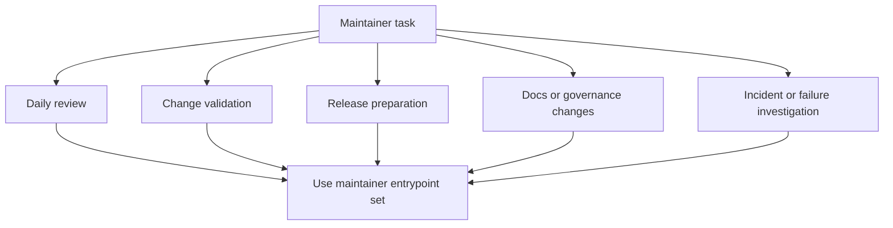

# Maintainer Entrypoints

Maintainers enter the control plane through `cargo run -p bijux-dev-atlas`,
`bijux dev atlas`, and curated `make` wrappers. This page exists to show which
entrypoint is best for which kind of maintainer work.

## Entrypoint Routing Model

This diagram is intentionally simple because the main lesson is practical: different maintainer jobs
should still begin from the same governed entrypoint set, not from ad hoc scripts or directory-local
shortcuts.

## Canonical Entrypoints

- `bijux dev atlas ...` is the canonical installed namespace for maintainer automation
- `cargo run -q -p bijux-dev-atlas -- ...` is the repo-local direct binary path for exact local parity
- `make ci-fast`, `make ci-pr`, `make ci-nightly`, `make docs-build`, and other curated targets are the convenience layer for common workflows
- GitHub workflows under [`.github/workflows`](/Users/bijan/bijux/bijux-atlas/.github/workflows) are the remote execution entrypoints once a change moves into CI or release automation

## Which Entrypoint To Prefer

- use `make` when you want the standard maintainer lane with the least command memorization
- use `bijux dev atlas` when you want a documented control-plane surface that maps cleanly to maintainer docs
- use direct `cargo run -q -p bijux-dev-atlas -- ...` when you need an exact in-repo command, debug fidelity, or a command not exposed as a make wrapper
- use GitHub workflows when the question is about merge gates, release promotion, or environment-specific CI behavior rather than local iteration

## What Not To Use As An Entrypoint

- ad hoc root scripts that bypass the Rust control plane
- crate-local scratch commands that hide side effects or artifact paths
- undocumented shell aliases that make evidence or reproduction harder for another maintainer

## Repository Anchors

- [`crates/bijux-dev-atlas/src/interfaces/cli/mod.rs`](/Users/bijan/bijux/bijux-atlas/crates/bijux-dev-atlas/src/interfaces/cli/mod.rs:1) defines the direct command surface
- [`configs/sources/governance/governance/cli-dev-command-surface.json`](/Users/bijan/bijux/bijux-atlas/configs/sources/governance/governance/cli-dev-command-surface.json:1) records the governed command families
- [`.github/pull_request_template.md`](/Users/bijan/bijux/bijux-atlas/.github/pull_request_template.md:1) records the validation evidence maintainers should bring back from those entrypoints

## Main Takeaway

Maintainer entrypoints are part of repository governance. The right starting command should make the
work reproducible, route to the right policy, and leave behind evidence another maintainer can
understand without reconstructing your local habits.
