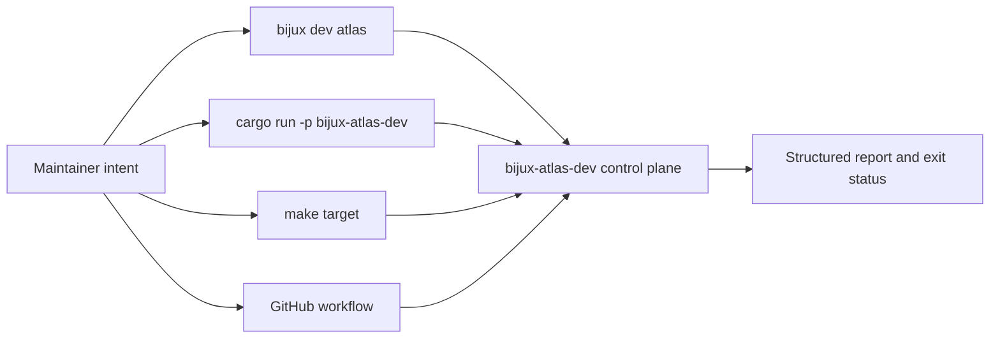

# Maintainer Entrypoints

Atlas exposes one repository control plane through four routes. They are an
installed umbrella, a direct crate binary, curated Make targets, and GitHub
workflows. Choose by execution context. Retain the report produced by the
command that actually ran.


```mermaid
flowchart LR
    Intent[Maintainer intent] --> Installed[bijux dev atlas]
    Intent --> Local[cargo run -p bijux-atlas-dev]
    Intent --> Make[make target]
    Intent --> GitHub[GitHub workflow]
    Installed --> Control[bijux-atlas-dev control plane]
    Local --> Control
    Make --> Control
    GitHub --> Control
    Control --> Report[Structured report and exit status]
```

## Route Selection

| Route | Prefer it when | Evidence boundary |
| --- | --- | --- |
| `bijux dev atlas ...` | umbrella is installed | preserve arguments, authority, output, and status |
| `cargo run --locked ...` | working from a checkout | binds source and lockfile to the invocation |
| `make <target>` | invoking a curated lane | proves only the commands selected by that target |
| GitHub workflow | hosted behavior matters | binds revision, permissions, runner, and artifacts |

Use `--format json` for evidence consumed by automation. Human output is for
interactive diagnosis and may omit fields that are present in the structured
report. Capability flags remain explicit regardless of route. A wrapper must
not grant write, subprocess, network, or git authority implicitly.

## Common Starting Points

```bash
bijux dev atlas check list --domain docs --format json
bijux dev atlas suites list --format json
bijux dev atlas docs validate --format json
bijux dev atlas ops validate --profile kind --format json
```

For checkout-local parity, replace the prefix with:

```bash
cargo run --locked -q -p bijux-atlas-dev --
```

Use targeted commands during development. `make ci-nightly` selects the broad
nightly lane and is not the default proof for a documentation-only change.

## Reproducible Handoff

Record the route, arguments, revision, capabilities, report path, and exit
status. Include any external target identity. Shell aliases or scratch commands
that omit these details are unsuitable as shared evidence.

## Wrapper Failure Semantics

| Observation | Interpretation |
| --- | --- |
| direct command is absent | the binary and documentation are out of sync; a wrapper cannot repair the missing route |
| wrapper selects different arguments | route parity is broken even if both invocations exit successfully |
| report fails but wrapper exits zero | the wrapper hid failure and cannot support a pass claim |
| wrapper grants broader capabilities | the effective authorization changed and requires explicit review |
| hosted run lacks expected artifact | the handoff is incomplete even if the log shows successful execution |

Compare the resolved command and retained report, not only the wrapper target
name. A route is trustworthy when it preserves selection, authority, output,
and exit behavior.

## Compatibility Boundary

The direct binary is the executable authority. Other routes are supported when
their checked-in delegation preserves the command contract. Command names,
selectors, capability flags, structured output, and exit semantics require
consumer review when changed.
