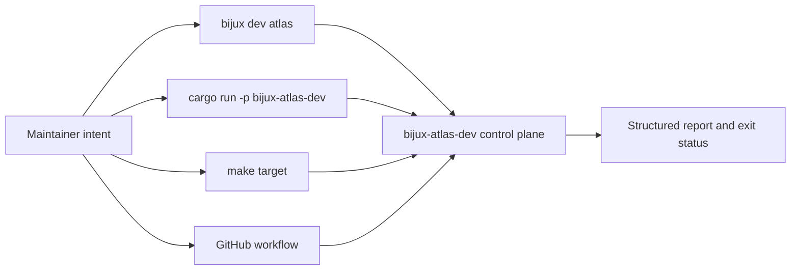

# Maintainer Entrypoints

Atlas exposes one repository control plane through four routes. They are an
installed umbrella, a direct crate binary, curated Make targets, and GitHub
workflows. Choose by execution context. Retain the report produced by the
command that actually ran.


```mermaid
flowchart LR
    Intent[Maintainer intent] --> Installed[bijux dev atlas]
    Intent --> Local[cargo run -p bijux-atlas-dev]
    Intent --> Make[make target]
    Intent --> GitHub[GitHub workflow]
    Installed --> Control[bijux-atlas-dev control plane]
    Local --> Control
    Make --> Control
    GitHub --> Control
    Control --> Report[Structured report and exit status]
```

## Route Selection

| Route | Prefer it when | Evidence boundary |
| --- | --- | --- |
| `bijux dev atlas ...` | the Bijux umbrella is installed | delegation must preserve arguments, capabilities, output, and exit status |
| `cargo run --locked -q -p bijux-atlas-dev -- ...` | working directly from a checkout | identifies the repository source and lockfile used by the invocation |
| `make <target>` | invoking a governed convenience lane | covers commands selected by the current Make definition, not the whole domain |
| `.github/workflows/*.yml` | hosted merge, audit, or release behavior matters | binds results to the revision, workflow, permissions, runner, and artifact set |

Use `--format json` for evidence consumed by automation. Human output is for
interactive diagnosis and may omit fields that are present in the structured
report. Capability flags remain explicit regardless of route. A wrapper must
not grant write, subprocess, network, or git authority implicitly.

## Common Starting Points

```bash
bijux dev atlas check list --domain docs --format json
bijux dev atlas suites list --format json
bijux dev atlas docs validate --format json
bijux dev atlas ops validate --profile kind --format json
```

For checkout-local parity, replace the prefix with:

```bash
cargo run --locked -q -p bijux-atlas-dev --
```

Use targeted commands during development. `make ci-nightly` selects the broad
nightly lane and is not the default proof for a documentation-only change.

## Reproducible Handoff

Record the route, arguments, revision, capabilities, report path, and exit
status. Include any external target identity. Shell aliases or scratch commands
that omit these details are unsuitable as shared evidence.

## Stability

The direct binary is the executable authority. Other routes are supported when
their checked-in delegation preserves the command contract.
