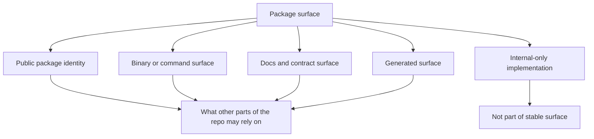

# Package Surface

`bijux-dev-atlas` is the Rust control-plane package that owns repository
automation, docs governance, reports, and enforcement.

## Package Surface Model

This page exists so maintainers do not flatten everything inside `bijux-dev-atlas` into one support
promise. Some parts of the crate are relied on by docs, workflows, and other maintainers; other
parts are free to evolve as implementation detail.

## Stable Surface Expectations

- the binary identity `bijux-dev-atlas`
- the documented `bijux dev atlas` maintainer namespace it backs
- the governed command families recorded in the command-surface registry
- the generated reports and docs references that other workflows consume

## Internal Surface Expectations

- internal routing details
- command handler structure
- private modules and refactors that do not change documented command behavior, report shape, or evidence paths

Those internals still deserve care, but they are not automatically part of the stable maintainer
contract unless another authoritative page promotes them into that role.

## Repository Anchors

- [`crates/bijux-dev-atlas/src/interfaces/cli/mod.rs`](/Users/bijan/bijux/bijux-atlas/crates/bijux-dev-atlas/src/interfaces/cli/mod.rs:1) defines the public command and binary surface
- [`configs/sources/governance/governance/cli-dev-command-surface.json`](/Users/bijan/bijux/bijux-atlas/configs/sources/governance/governance/cli-dev-command-surface.json:1) records the governed top-level command families
- [`docs/bijux-atlas-dev/automation/automation-command-surface.md`](/Users/bijan/bijux/bijux-atlas/docs/bijux-atlas-dev/automation/automation-command-surface.md:1) documents the maintainer-facing command contract

## Main Takeaway

The `bijux-dev-atlas` package is not just another crate in the workspace. It is the maintainer
control-plane package, which means its stable binary, docs, reports, and command behavior carry a
repository-wide support burden that ordinary internal refactors do not.
