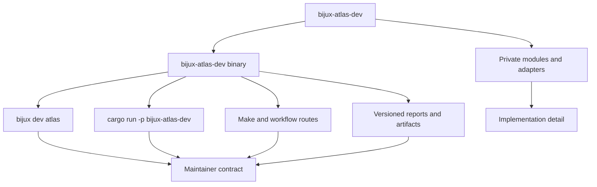

# Package Surface

`bijux-atlas-dev` is a repository-only crate with `publish = false`. Its
supported surface is the maintainer binary, its installed umbrella route,
governed command identities, report contracts, and generated outputs—not a
public Rust library API.

```mermaid
flowchart TD
    Crate[bijux-atlas-dev] --> Binary[bijux-atlas-dev binary]
    Binary --> Umbrella[bijux dev atlas]
    Binary --> Direct[cargo run -p bijux-atlas-dev]
    Binary --> Wrappers[Make and workflow routes]
    Binary --> Reports[Versioned reports and artifacts]
    Crate --> Internal[Private modules and adapters]
    Umbrella --> Contract[Maintainer contract]
    Direct --> Contract
    Wrappers --> Contract
    Reports --> Contract
    Internal --> Detail[Implementation detail]
```

## Supported Surface

- the `bijux-atlas-dev` binary identity and exit behavior;
- the `bijux dev atlas ...` installed namespace when the Bijux umbrella is
  present;
- command and suite identifiers consumed by Make, CI, and documentation;
- capability flags controlling write, subprocess, network, and git effects;
- structured report kinds, schema versions, paths, and validation commands;
- generated references whose registries name this binary as their generator.

Internal handlers, module layout, and adapter implementations can change while
those observable contracts remain stable. A private Rust symbol becomes a
compatibility concern only when another supported repository surface consumes
it as an authority.

## Command Authorities

The compiled CLI in `crates/bijux-atlas-dev/src/interfaces/cli/` is the
executable authority. The policy declaration at
`configs/sources/governance/governance/cli-dev-command-surface.json` records the
intended top-level families and forbidden product flows. The two must be
validated together; configuration does not create a runnable command.

At this revision, compiled `--help` and the policy declaration are not
identical. The declaration lists `clients`, `packages`, and `demo`, which are
not exposed as compiled top-level commands, while compiled help exposes
`migrations`, which is not listed in the declaration. Treat that difference as
registry drift rather than silently promising either side as synchronized.

The registry also forbids `query` as a maintainer user-flow command. Product
queries belong to `bijux atlas`, while repository validation and evidence
remain under `bijux dev atlas`.

## Compatibility Boundary

Changing a command name, capability requirement, report schema, or governed
artifact path requires consumer and workflow review. Moving internal modules
does not, provided direct CLI, umbrella, Make, and workflow routes retain their
claimed parity. See [Automation Command Surface](../automation/automation-command-surface.md)
for command selection and report discovery.

## Stability

The crate is not published to crates.io, so its stability is repository
contract stability rather than a public library SemVer promise. Checked-in
consumers and documented maintainer commands define the support burden.
