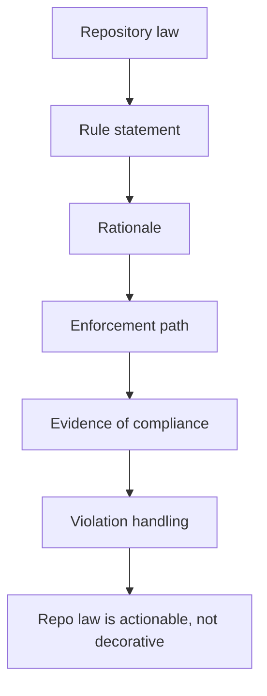

# Repository Laws

Repository laws are declared data, not folk wisdom.

## Repository Law Model

The key idea is that a repository law in Atlas is not a slogan. It is a tracked rule with enough
shape that maintainers can understand what it protects and how drift is supposed to be caught.

## Source Anchor

- [`configs/sources/repository/repo-laws.json`](/Users/bijan/bijux/bijux-atlas/configs/sources/repository/repo-laws.json:1)

## Current Laws In Plain Language

The current registry declares laws that say:

- runtime artifacts stay out of tracked source except for governed examples
- repository automation orchestration stays owned by the Rust control plane
- docs and configs stay navigable through index and ownership contracts
- retired script and tool roots stay absent
- the root `Makefile` stays a thin include entrypoint
- root layout stays within the allowlisted repository surface

## Why Maintainers Should Use These Laws

- they turn broad repository discipline into named rules that can be referenced in review
- they make structural regressions easier to explain than vague "please keep things tidy" comments
- they keep core architectural promises durable even when individual implementations change

## Main Takeaway

Repository laws are Atlas's structural guardrails written as data. They matter because they let
maintainers argue from a declared repository rule, with rationale and enforcement, instead of from
personal preference or fading project memory.
