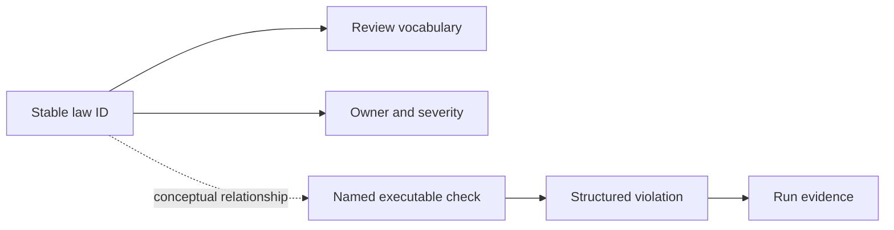

# Repository Laws

Repository laws name the structural invariants Atlas expects maintainers and
automation to preserve. Their authority is
`configs/sources/repository/repo-laws.json`. Each row has a stable ID, severity,
owner, and plain-language statement.

## Declared Laws

| ID | Severity | Invariant |
| --- | --- | --- |
| `repo_artifacts_stay_ephemeral` | high | runtime artifacts remain outside tracked source except for governed examples |
| `repo_control_plane_stays_rust_owned` | high | repository orchestration remains in the Rust control plane |
| `repo_docs_and_configs_are_navigable` | medium | documentation and configuration remain discoverable through indexes and ownership contracts |
| `repo_legacy_script_roots_stay_absent` | medium | retired script and tool roots remain absent |
| `repo_makes_entrypoint_stays_include_only` | high | the root Makefile remains a thin include entrypoint |
| `repo_root_layout_stays_allowlisted` | high | root directories and Markdown files remain within the approved surface |


```mermaid
flowchart LR
    Law[Stable law ID] --> Review[Review vocabulary]
    Law --> Metadata[Owner and severity]
    Check[Named executable check] --> Finding[Structured violation]
    Finding --> Evidence[Run evidence]
    Law -. conceptual relationship .-> Check
```

The dashed edge is important. The law file does not encode a check ID,
rationale, exception, or evidence path for each law. Enforcement is implemented
by separately registered repository checks. A law statement is therefore an
authoritative invariant and review vocabulary, but the file alone is not proof
that the invariant is executable or currently passing.

## What Is Validated

The focused metadata check requires every law to have a non-empty ID, severity,
and owner; rejects duplicate IDs; and requires lexicographic ordering by ID.
It does not validate the statement field, restrict severity to a vocabulary, or
prove one-to-one coverage by executable checks.

```bash
bijux-atlas-dev check run \
  --repo-root . \
  --id checks_repo_law_metadata_complete_and_unique \
  --include-internal \
  --format json
```

Other checks enforce concrete repository properties such as root allowlists,
tracked artifacts, Makefile shape, and retired roots. Their evidence establishes
those named checks, not an automatic aggregate status for all six law IDs.

## Adding or Changing a Law

A durable law change should coordinate four things:

1. a stable domain-based ID and precise statement;
2. an accountable owner and severity;
3. one or more named checks with unambiguous failure evidence; and
4. documentation that maps the law to its enforcement depth and exceptions.

If enforcement is intentionally advisory or absent, say so in review. Keeping
that gap visible is more trustworthy than implying that declaration and
enforcement are the same mechanism.
