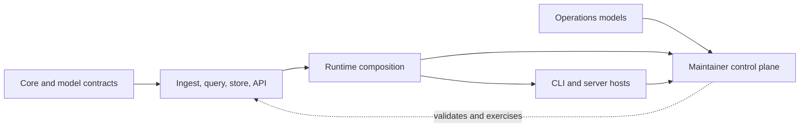

# Runtime Ownership Boundary

`bijux-atlas-dev` is the repository control plane. It may validate, exercise,
and report runtime behavior, but it must not become an alternate implementation
of product behavior. The direction is from maintainer orchestration toward
published product contracts, never from product crates back into repository
automation.

## Dependency Direction

The dotted edge is observation, not ownership. A maintainer command can invoke
a public runtime route and compare its output with a contract. The command must
not copy the parser, planner, router, or policy decision into `bijux-atlas-dev`.

## Forbidden ownership

The maintainer crate must not own:

- ingest normalization and source parsing semantics;
- dataset query planning and execution semantics;
- store publication, catalog, cursor, or dataset identity rules;
- server route behavior and HTTP runtime policy decisions;
- end-user CLI behavior for `bijux-atlas` runtime commands; or
- compatibility behavior that belongs to a published product surface.

Warning signs include duplicated DTOs, copied error mappings, command handlers
that answer product requests directly, or tests that can pass after the owning
runtime implementation is removed.

## Allowed ownership

The maintainer crate may own:

- repository governance validation and policy checks;
- documentation, release, and operations control-plane workflows;
- registry discovery, check selection, effect authorization, and report
  encoding;
- evidence and report generation for maintainer use;
- adapters that invoke the public CLI, HTTP, library, Helm, or Kubernetes
  surface with explicit capabilities; and
- cross-crate architecture tests that enforce ownership direction.

## Cross-Boundary Interaction

| Need | Correct dependency | Incorrect shortcut |
| --- | --- | --- |
| verify query behavior | call the query/runtime public contract with governed fixtures | reimplement planning in a maintainer check |
| inspect API compatibility | consume OpenAPI and public DTO/error contracts | construct a second router in the control plane |
| test ingest | invoke the ingest workflow and inspect its artifact contract | parse source records inside the maintainer crate |
| validate deployment | use operations models and rendered product configuration | embed product defaults in workflow code |
| generate evidence | preserve public outputs, identities, and findings | translate a product failure into an unrelated success schema |

When a required observation is unavailable, extend the owning product or
operations contract first. Adding private reach-through from the maintainer
crate creates an unreviewed integration surface and makes the evidence depend
on implementation details.

## Enforcement

`crates/bijux-atlas-dev/tests/architecture_runtime_ownership.rs` checks this
document and scans maintainer source for representative forbidden runtime
tokens. Layering and runtime ownership tests elsewhere in the workspace enforce
additional dependency direction.

The scan is a guardrail, not a complete semantic proof. Review new commands for
copied domain rules even when the token check passes. A boundary change is
complete only when the owning crate, public contract, maintainer adapter, and
focused tests all agree.

Continue with [Crate Boundary Review](crate-boundary-review.md) for the complete
workspace map and [Package Surface](package-surface.md) for publication
ownership.
