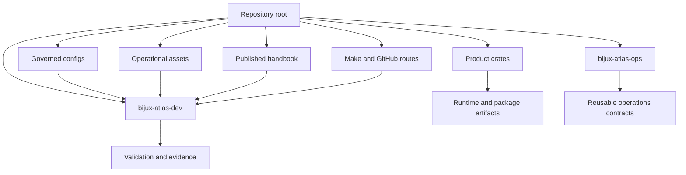
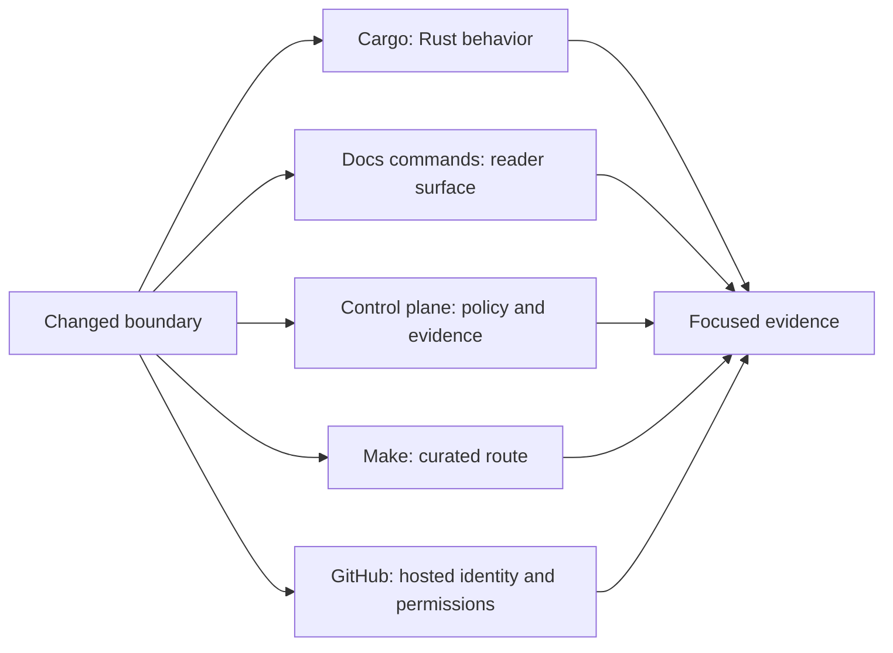

# Workspace and Tooling

Atlas is a twelve-crate Rust workspace surrounded by governed configuration,
operations, documentation, and delivery inputs. A crate can compile while the
repository contract is broken, so choose tooling from the boundary changed by
the work rather than treating `cargo test` as universal proof.

## Workspace View

Product crates own runtime behavior. `bijux-atlas-ops` owns reusable
operational models. `bijux-atlas-dev` validates and orchestrates repository
concerns without becoming a runtime dependency. Configuration, operations, and
documentation are governed inputs, not decoration around the crates.

## Tooling View

| Tool | Establishes | Does not establish by itself |
| --- | --- | --- |
| Cargo | selected Rust build, test, example, or API behavior | docs, deployment, or publication |
| `bijux-atlas-dev` | its named repository or evidence check | broader behavior than that command implements |
| governed MkDocs route | configured site rendering | factual accuracy or publication success |
| Make | the commands delegated by one reviewed target | behavior outside that target |
| GitHub Actions | a hosted run with revision and runner identity | local parity or unselected release lanes |

## Choose the Narrowest Proof

1. Name the consumer-visible claim affected by the change.
2. Identify its owning crate, registry, schema, workflow, or handbook page.
3. Run the narrowest command that exercises that authority.
4. Preserve structured output when another person or lane will consume it.
5. Expand to an integration or release lane only when the claim crosses that
   boundary.

A broad green lane can coexist with a specific contract defect. Focused proof
should precede broad confidence, not be replaced by it.

## Toolchain Baseline

The current workspace MSRV and pinned Rust toolchain are both `1.86.0`.

If `Cargo.toml`, `rust-toolchain.toml`, and release validation disagree about
that version, treat it as a release blocker rather than cosmetic drift.

## Workspace Discipline

- run repository commands from the workspace root or pass `--repo-root`
  explicitly;
- keep generated reports and disposable run products under `artifacts/`;
- keep caches distinct from evidence and checked-in examples distinct from
  observed results;
- inspect wrapper delegation before assuming direct, Make, umbrella, and
  workflow routes are equivalent;
- update the owning source before regenerating derived references;
- report skipped or unavailable checks instead of converting them into an
  implied pass.

## Handoff Record

A useful handoff names the revision, changed authority, command route, exact
selector, granted capabilities, result, and artifact path. That record lets a
reviewer distinguish “the repository was checked” from the more precise claim
that a particular contract was exercised against particular inputs.
