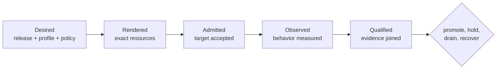
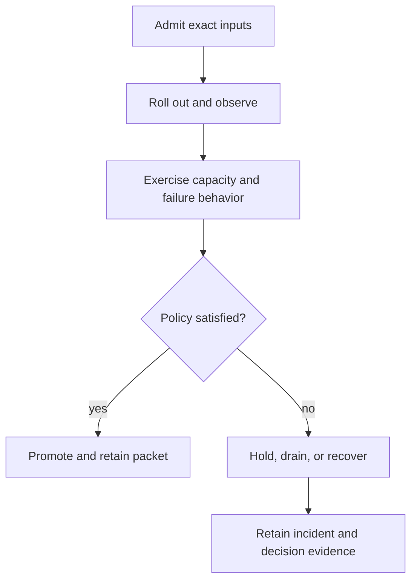

# bijux-atlas-ops

Atlas operations governs the path from an immutable dataset release to a
defensible decision: promote it, keep it serving, hold it, drain traffic, or
recover a known-good state. That path spans topology, Kubernetes, security,
observability, load, and release custody. A healthy process or a successful
Helm render is useful evidence, but neither is a complete operating verdict.

The system has three cooperating surfaces:

| Surface | Authority |
| --- | --- |
| `ops/` | Profiles, charts, policies, schemas, scenarios, thresholds, dashboards, runbooks, and evidence inputs |
| `bijux-atlas-ops` | Reusable models, path contracts, deterministic validation, and explicit adapters to external state |
| `bijux-atlas-dev ops` | Repository orchestration, effect gates, and report emission |

Generated reports record observations. They do not rewrite the policies or
release identities that produced them.

## The operating ledger

Every operating decision should be traceable through five records:

| Record | Question it answers | Invalidated by |
| --- | --- | --- |
| desired | What is intended to run, under which policy? | A changed release, profile, policy, or target |
| rendered | What exact resources would those inputs create? | A changed chart, values chain, image pin, or render tool |
| admitted | What did the target accept? | A new workload revision, mutation, or target identity |
| observed | How did that admitted state behave? | A changed serving identity or a new observation window |
| qualified | Which decision does the joined evidence support? | A broken identity join, failed requirement, or unrecorded exception |

Retain failed ledger paths. They explain why a release was held and prevent an
observation from one workload or dataset from being attached to another.

## Decision identity

A promotion packet needs stable join keys across six authorities:

| Authority | Identity to retain |
| --- | --- |
| product | Runtime revision and immutable artifact digest |
| dataset | Release, species, assembly, manifest, and payload hashes |
| deployment | Chart, values digest, profile, namespace, and workload revision |
| target | Cluster, dependency composition, and observation boundary |
| execution | Command or scenario, tool versions, start time, and run ID |
| decision | Policy, verdict, reviewer, exceptions, and packet digest |

Telemetry and scenario reports can carry compact join keys rather than every
field. If those keys cannot recover the target and release identities, the
result is diagnostic material rather than promotion evidence.

## Operational domains

| Domain | Governs | Begin with |
| --- | --- | --- |
| topology | Components, dependencies, profiles, pins, and failure roles | [Stack](stack/index.md) |
| delivery | Rendering, admission, rollout, rollback, and confinement | [Kubernetes](kubernetes/index.md) |
| assurance | Threats, identity, authorization, audit, and artifact trust | [Security](security/index.md) |
| signals | Health, readiness, overload, metrics, logs, traces, alerts, and drills | [Observability](observability/index.md) |
| capacity | Workloads, thresholds, baselines, concurrency, churn, and outages | [Load](load/index.md) |
| custody | Distribution, checksums, provenance, evidence bundles, and recovery | [Release](release/index.md) |

The domains share identity but not authority. A rendered manifest cannot prove
readiness. A passing load scenario cannot prove rollback. A complete telemetry
inventory cannot prove that signals arrived during the decision window.

## Operator control loops

Use `bijux dev atlas ops --help` for the installed maintainer interface, or
`cargo run --locked -p bijux-atlas-dev -- ops --help` from a checkout. Inspect
the selected subcommand before granting subprocess, network, cluster, or write
effects. Command availability identifies a mechanism; environment policy still
decides which checks and observation windows are required.

## Start by outcome

- choose a composition: [Deployment Models](stack/deployment-models.md) and
  [Service Topology](stack/service-topology.md)
- render or change a deployment: [Kubernetes](kubernetes/index.md) and
  [Rollout Safety](kubernetes/rollout-safety.md)
- qualify an exposure boundary: [Security](security/index.md) and
  [Security Operations](kubernetes/security-operations.md)
- investigate serving behavior: [Health, Readiness, and Drain](observability/health-readiness-and-drain.md)
  and [Incident Response](observability/incident-response.md)
- establish an operating envelope: [Load](load/index.md) and
  [Thresholds and Budgets](load/thresholds-and-budgets.md)
- verify release custody: [Signing and Provenance](release/signing-and-provenance.md)
  and [Release Evidence](release/release-evidence.md)

## Current proof boundary

Checked-in contracts describe the intended system; they do not claim that a
target ran or passed them. In particular, the Kubernetes conformance catalog
declares 79 checks and five suite selections, while the current
`ops k8s conformance` command performs a narrower readiness snapshot over
deployments, pods, and HPA metrics API availability. Treat the catalog as
declared coverage and the command output as snapshot evidence until execution
binds selected check IDs, policy, and results end to end. See
[Kubernetes Conformance Suites](kubernetes/conformance-suites.md).
