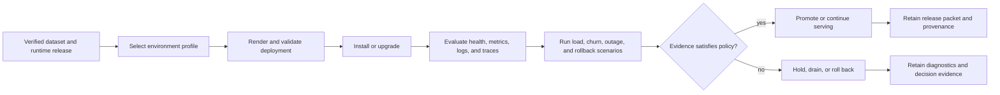
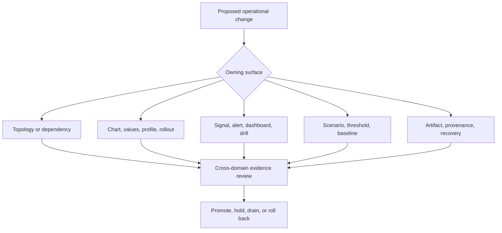

# bijux-atlas-ops

Atlas operations is a governed control plane for deploying immutable dataset
releases and deciding whether a runtime is safe to promote, keep serving, or
roll back. Its contracts cover topology, Kubernetes, security, observability,
load, resilience, drift, recovery, and release evidence.

## Operating Model

An installation is not considered safe because Helm rendered successfully.
Rendering proves shape. Probes establish process and traffic state. Telemetry
shows runtime behavior. Governed scenarios test performance and survival.
Release evidence binds the final decision to the exact artifacts and policy.

## Operational Domains

### [Stack](stack/index.md)

Owns component roles, dependencies, profiles, versions, and local and Kind
topology. Its primary evidence is the stack index, dependency graph, and version
manifest.

### [Kubernetes](kubernetes/index.md)

Owns chart schema, values profiles, installation, upgrade, rollback, network
policy, and workload security. Rendered inventory, conformance reports, rollout
records, and debug bundles provide the evidence.

### [Observability](observability/index.md)

Owns health, readiness, overload, alerts, dashboards, logs, metrics, traces, and
drills. Evidence comes from the telemetry index, rule validation, dashboard
checks, and drill results.

### [Load](load/index.md)

Owns scenario identity, query packs, thresholds, baselines, concurrency, churn,
and outage workloads. Load summaries, threshold evaluations, and baseline
comparisons record the decisions.

### [Release](release/index.md)

Owns version manifests, distribution, checksums, provenance, evidence bundles,
and recovery. Verification results, release packets, SBOMs, and rollback
evidence support promotion.

Cross-cutting inventory, schema, policy, security, drift, dataset, and
reproducibility contracts live under `ops/`. They connect these domains and
prevent one domain from making an isolated promotion claim.

## Operator Control Loops

| Loop | Input | Decision | Evidence to retain |
| --- | --- | --- | --- |
| admission | release identity, profile, values, images, and policy | reject or permit render and install | resolved versions, values digest, policy result, render inventory |
| rollout | desired replicas, probes, disruption rules, and traffic state | continue, hold, drain, or roll back | rollout events, readiness history, error and saturation signals |
| capacity | scenario, concurrency, thresholds, and baseline | accept, tune, or reject operating envelope | scenario identity, measurements, threshold evaluation, comparison |
| incident | symptoms, blast radius, recent changes, and dependencies | mitigate, isolate, recover, or escalate | timeline, queries, debug bundle, actions, recovery verification |
| promotion | artifacts, conformance, telemetry, load, and recovery proof | promote or refuse release | verified evidence packet bound to artifact identities |

The loops share release and environment identity but answer different
questions. Admission cannot stand in for runtime observation. A load result
cannot stand in for rollback proof. Incident evidence should preserve facts
even when no release decision follows.

## Decision Boundaries

The owning contract defines the first validation path. Cross-domain review is
required when effects escape that boundary. A chart change can affect network
policy, probes, dashboards, capacity, and rollback. A store change can affect
readiness, cache behavior, failure scenarios, and release reproducibility.

## Evidence Chain

Operators should be able to answer five questions for every promotion:

1. Which runtime, dataset release, chart, profile, values, and dependency
   versions were selected?
2. Which rendered resources and policy checks established deployability?
3. Which health, readiness, overload, telemetry, and user-path signals were
   observed?
4. Which load, churn, outage, upgrade, and rollback expectations were exercised?
5. Which checksums, provenance record, evidence manifest, and verification
   result bind the decision to the released artifacts?

Missing evidence is itself an operational finding. It must not be converted
into a pass because the runtime appears healthy at one instant.

## Evidence Strength

Operational assets answer different questions and are not interchangeable.

| Asset | Safe conclusion | Unsafe conclusion |
| --- | --- | --- |
| schema, policy, or threshold | the required shape and decision rule are explicit | the environment passed |
| sample or golden file | serializers and validators have a representative target | current runtime behavior matches the sample |
| rendered manifest | the selected values produce a concrete resource shape | the workload became ready or survived failure |
| telemetry inventory | expected signals have names and owners | signals were emitted, retained, or queried successfully |
| scenario report | the named behavior was observed for recorded inputs | another profile, version, or environment behaves identically |
| verified release packet | evidence and artifact identities agree | unrecorded operational assumptions are safe |

Use the weakest artifact that can answer an inspection question and the
strongest evidence required by the decision. Promotion needs observed,
release-bound proof; local design review often needs only the owning contract.

## Start by Outcome

- deploy or inspect a topology: [Deployment Models](stack/deployment-models.md)
  and [Service Topology](stack/service-topology.md)
- render, install, or upgrade: [Kubernetes](kubernetes/index.md) and
  [Rollout Safety](kubernetes/rollout-safety.md)
- secure a profile: [Security Operations](kubernetes/security-operations.md)
- investigate availability: [Health, Readiness, and Drain](observability/health-readiness-and-drain.md)
  and [Incident Response](observability/incident-response.md)
- qualify performance: [Performance and Load](load/performance-and-load.md)
  and [Thresholds and Budgets](load/thresholds-and-budgets.md)
- verify distribution: [Signing and Provenance](release/signing-and-provenance.md)
  and [Release Evidence](release/release-evidence.md)

## Current Proof Boundaries

Checked-in policies, schemas, inventories, scenarios, and samples define the
expected operational system. They do not claim that a cluster is running or
that a scenario executed. Generated and captured reports become operational
evidence only when they record the selected profile, environment, release,
inputs, timestamps, result, and artifact binding required by their contract.
