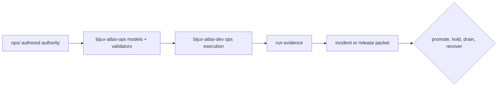
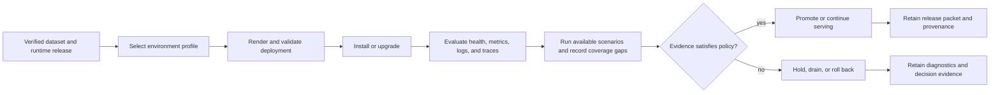
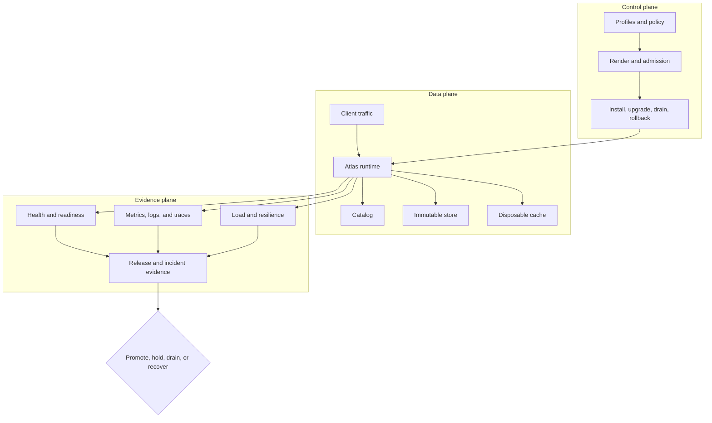
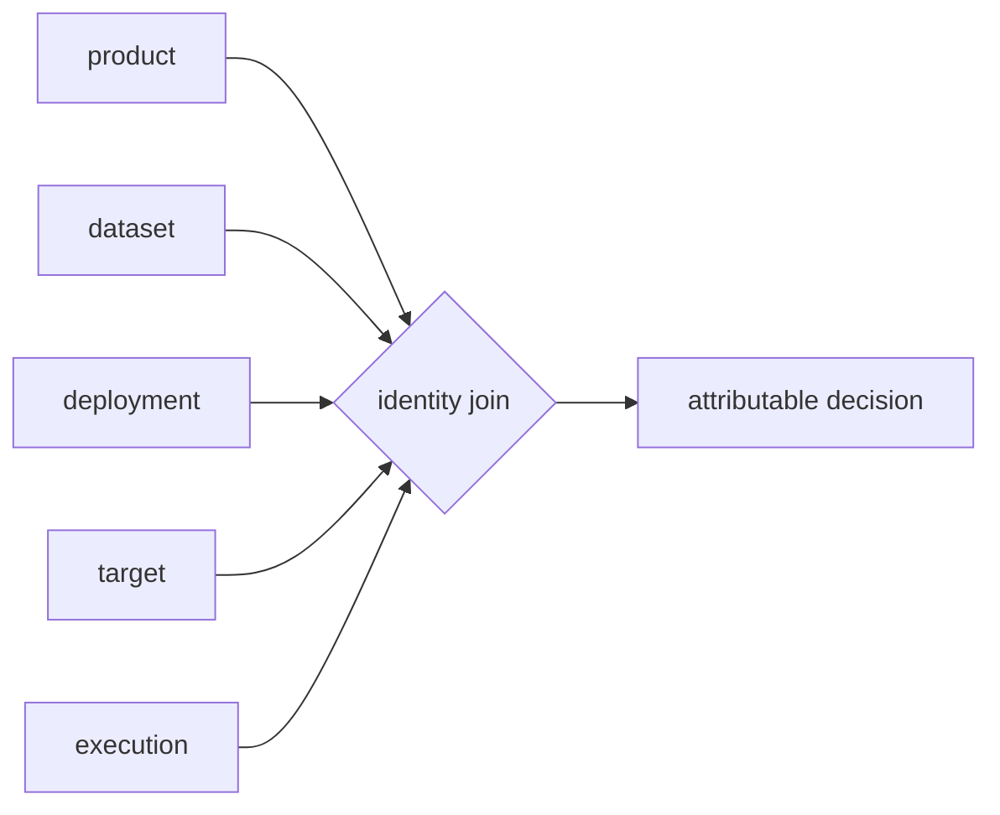
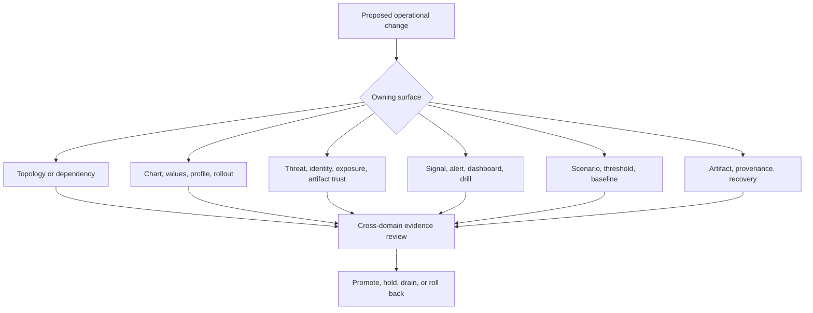

# bijux-atlas-ops

Atlas operations is a governed contract system for deploying immutable dataset
releases and deciding whether a runtime is safe to promote, keep serving, or
roll back. Its contracts cover topology, Kubernetes, security, observability,
load, resilience, drift, recovery, and release evidence.

The published `bijux-atlas-ops` crate provides reusable models, validators, and
repository path contracts. The repository-only `bijux-atlas-dev` command owns
executable orchestration. The `ops/` tree owns Helm, profiles, scenarios,
policies, schemas, dashboards, runbooks, and evidence inputs. None of these
surfaces alone is the complete operations system.

## Four Surfaces, Four Kinds of Authority

Atlas operations is larger than the published crate because policy, execution,
and evidence have different owners:

| Surface | Owns | Does not prove alone |
| --- | --- | --- |
| `ops/` | authored inventories, schemas, profiles, charts, scenarios, thresholds, runbooks and release inputs | that an environment executed or passed them |
| `bijux-atlas-ops` | typed models, path contracts, deterministic validation and explicit external-state adapters | that a caller granted effects or retained the result |
| `bijux-atlas-dev ops` | executable routing, capability gates, filesystem/process/cluster effects and report emission | that every declared inventory item has an implemented runner |
| generated run and release evidence | observed target, inputs, result, timing, identities and artifact binding | truth beyond the named check, scenario and observation window |

The chain is intentionally one-way. Generated evidence does not rewrite
authored policy; command availability does not expand the crate's contract;
and inventory presence does not imply executable coverage. Review a decision
from the final packet back to the selected inputs and release identity.

## Operating Model

An installation is not considered safe because Helm rendered successfully.
Rendering proves shape. Probes establish process and traffic state. Telemetry
shows runtime behavior. Executed governed scenarios can test performance and
survival. A registered scenario without an executable route proves only intent.
Release evidence binds the final decision to the exact artifacts and policy.

## Operational Architecture

Atlas operations spans three planes with different failure semantics:

The control plane can request a rollout but cannot declare serving correctness.
The data plane can answer traffic while the evidence plane is blind. The
evidence plane can retain observations but cannot mutate release truth. Safe
operation requires explicit agreement across all three.

| Plane failure | Immediate risk | Safe response |
| --- | --- | --- |
| control | state cannot be changed predictably | stop mutation; preserve workload identity |
| data | intended dataset cannot be served correctly | remove traffic; restore verified state |
| evidence | behavior cannot be measured or attributed | hold promotion and retain local diagnostics |
| cross-plane identity | release, profile, or dataset differs | reject the incoherent packet |

## Operating Packet Identity

Every operational result must identify both what ran and where it ran. The
minimum join spans six authorities:

| Authority | Identity retained |
| --- | --- |
| product | runtime revision and immutable artifact digest |
| dataset | release, species, assembly, manifest, and payload hashes |
| deployment | chart, values digest, profile, namespace, and workload revision |
| target | cluster, dependency composition, and observation boundary |
| execution | command or scenario, tool versions, start time, and run ID |
| decision | reviewer, policy, verdict, exceptions, and packet digest |

Telemetry labels, scenario reports, and release records do not need to repeat
every field inline, but they must carry stable join keys. A result that cannot
be joined back to its target and release is diagnostic material, not promotion
evidence.

## Operational Domains

### [Stack](stack/index.md)

Owns component roles, dependencies, profiles, versions, and local and Kind
topology. Its primary evidence is the stack index, dependency graph, and version
manifest.

### [Kubernetes](kubernetes/index.md)

Owns chart schema, values profiles, installation, upgrade, rollback, network
policy, and workload security. Rendered inventory, conformance reports, rollout
records, and debug bundles provide the evidence.

### [Security](security/index.md)

Owns threat and control coverage, request identity, authorization, audit,
workload and network confinement, secret custody, and artifact trust. Evidence
must connect governed intent to live positive and negative checks, detection,
and release binding.

### [Observability](observability/index.md)

Owns health, readiness, overload, alerts, dashboards, logs, metrics, traces, and
drills. Evidence comes from the telemetry index, rule validation, dashboard
checks, and drill results.

### [Load](load/index.md)

Owns scenario identity, query packs, thresholds, baselines, concurrency, churn,
and outage workloads. Load summaries, threshold evaluations, and baseline
comparisons record the decisions.

### [Release](release/index.md)

Owns version manifests, distribution, checksums, provenance, evidence bundles,
and recovery. Verification results, release packets, SBOMs, and rollback
evidence support promotion.

Cross-cutting inventory, schema, policy, drift, dataset, and
reproducibility contracts live under `ops/`. They connect these domains and
prevent one domain from making an isolated promotion claim.

## Executable Routes and Ownership

The installed maintainer route is `bijux dev atlas ops ...`; a checkout can use
`cargo run --locked -p bijux-atlas-dev -- ops ...`. The command family is broad,
but its subcommands still have narrow proof boundaries:

| Route | Primary use | Strongest safe claim from success alone |
| --- | --- | --- |
| `ops stack plan` | resolve composition | profile and planned components are inspectable |
| `ops stack status` | inspect local services | named services were observed at that time |
| `ops k8s render`, `validate` | check Kubernetes input | shape passed implemented validators |
| `ops k8s conformance` | inspect readiness | current deployment, pod, and HPA snapshot passed |
| `ops obs verify` | verify selected signals | that observability verification completed |
| `ops load plan`, `run`, `evaluate` | run a load contract | measurements satisfy that scenario and threshold |
| `ops evidence collect`, `verify` | check evidence binding | packet passed implemented binding checks |

The executable observability subcommand is named `obs`. Documentation uses the
full domain name “observability” for readers, but command examples must preserve
the compiled route. Always inspect `--help` for the selected subcommand before
granting cluster, subprocess, network, or write authority.

Commands expose mechanisms, not a universal promotion recipe. An environment's
policy decides which routes, observation windows, scenarios, and recovery proof
are required for its decision.

## Operator Control Loops

| Loop | Input | Decision | Evidence to retain |
| --- | --- | --- | --- |
| admission | release inputs | permit render and install | versions, values digest, policy, inventory |
| rollout | workload and traffic state | continue, drain, roll back | events, readiness, error, saturation |
| capacity | scenario, concurrency, baseline | accept or reject envelope | measurements and threshold evaluation |
| incident | symptoms, changes, dependencies | mitigate, recover, escalate | timeline, diagnostics, recovery result |
| promotion | artifact and operating proof | promote or refuse | verified packet bound to artifacts |

The loops share release and environment identity but answer different
questions. Admission cannot stand in for runtime observation. A load result
cannot stand in for rollback proof. Incident evidence should preserve facts
even when no release decision follows.

## Decision Boundaries

The owning contract defines the first validation path. Cross-domain review is
required when effects escape that boundary. A chart change can affect network
policy, probes, dashboards, capacity, and rollback. A store change can affect
readiness, cache behavior, failure scenarios, and release reproducibility.

## Evidence Chain

Operators should be able to answer five questions for every promotion:

1. Which runtime, dataset release, chart, profile, values, and dependency
   versions were selected?
2. Which rendered resources and policy checks established deployability?
3. Which health, readiness, overload, telemetry, and user-path signals were
   observed?
4. Which load, churn, outage, upgrade, and rollback expectations were exercised?
5. Which checksums, provenance record, evidence manifest, and verification
   result bind the decision to the released artifacts?

Missing evidence is itself an operational finding. It must not be converted
into a pass because the runtime appears healthy at one instant.

## Evidence Strength

Operational assets answer different questions and are not interchangeable.

| Asset | Safe conclusion | Unsafe conclusion |
| --- | --- | --- |
| schema, policy, or threshold | the required shape and decision rule are explicit | the environment passed |
| sample or golden file | representative validator target exists | runtime matches the sample |
| rendered manifest | values produce a resource shape | workload became ready or survived |
| telemetry inventory | expected signals have names and owners | signals were emitted and retained |
| scenario report | named behavior was observed | another target behaves identically |
| verified release packet | evidence and artifact identities agree | unrecorded operational assumptions are safe |

Use the weakest artifact that can answer an inspection question and the
strongest evidence required by the decision. Promotion needs observed,
release-bound proof; local design review often needs only the owning contract.

## Start by Outcome

- deploy or inspect a topology: [Deployment Models](stack/deployment-models.md)
  and [Service Topology](stack/service-topology.md)
- render, install, or upgrade: [Kubernetes](kubernetes/index.md) and
  [Rollout Safety](kubernetes/rollout-safety.md)
- qualify a security boundary: [Security Assurance](security/index.md) and
  [Security Operations](kubernetes/security-operations.md)
- investigate availability: [Health, Readiness, and Drain](observability/health-readiness-and-drain.md)
  and [Incident Response](observability/incident-response.md)
- qualify performance: [Performance and Load](load/performance-and-load.md)
  and [Thresholds and Budgets](load/thresholds-and-budgets.md)
- verify distribution: [Signing and Provenance](release/signing-and-provenance.md)
  and [Release Evidence](release/release-evidence.md)

## Current Proof Boundaries

Checked-in policies, schemas, inventories, scenarios, and samples define the
expected operational system. They do not claim that a cluster is running or
that a scenario executed. Generated and captured reports become operational
evidence only when they record the selected profile, environment, release,
inputs, timestamps, result, and artifact binding required by their contract.

The Kubernetes conformance catalog declares 79 checks and five suite
selections, but the current `ops k8s conformance` implementation performs a
narrow workload-readiness snapshot over deployments, pods, and HPA metrics API
availability. It does not execute the catalog manifest. Treat the catalog as
declared coverage and the command report as readiness evidence until a runner
binds the selected check IDs, suite policy, and results end to end. See
[Kubernetes Conformance Suites](kubernetes/conformance-suites.md) for the exact
boundary.
