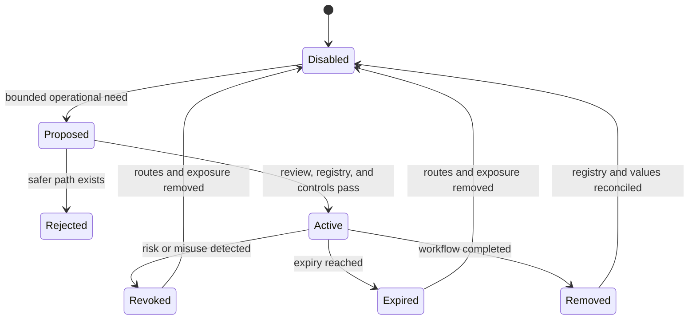
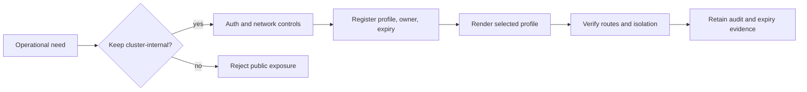

# Admin Endpoint Exceptions

Atlas keeps recovery, diagnostics, failure-injection, and chaos controls out of
the public route set unless administrative endpoints are explicitly enabled.
The Helm default is `server.adminEndpoints.enabled: false`, which renders
`ATLAS_ENABLE_ADMIN_ENDPOINTS=false`; the runtime default is also false.

When enabled, the server adds these routes:

| Method | Route | Capability |
| --- | --- | --- |
| `POST` | `/debug/recovery/run` | execute a recovery control |
| `GET` | `/debug/recovery/diagnostics` | inspect recovery diagnostics |
| `POST` | `/debug/failure-injection` | invoke a supported failure target |
| `POST` | `/debug/chaos/run` | run a chaos action for an explicit node |

The feature flag changes route registration; it is not, by itself, an
authentication or network-isolation control. An operator must evaluate auth,
service exposure, ingress, and network policy together.

## Exception Lifecycle

An exception is active only while the registry, selected profile, rendered
configuration, reachability controls, and runtime route set agree. Review
approval without that agreement is not an active exception.

## Default Policy

`ops/k8s/admin-endpoints-exceptions.json` currently contains an empty
`exceptions` array. No profile has a recorded exception. Enabling the endpoints
without an approved registry entry therefore conflicts with the checked-in
operations policy even if the chart renders successfully.

## Registry Contract

The current schema accepts only three fields per exception:

| Field | Meaning |
| --- | --- |
| `profile` | exact profile receiving the exception |
| `owner` | accountable owner for removal or renewal |
| `expiresOn` | calendar expiry in `YYYY-MM-DD` form |

The schema does **not** serialize the route, reason, compensating controls, or
evidence references. Those details must accompany the change review, but they
are not recoverable from the registry alone. Do not claim that the current JSON
record provides a complete exception rationale.

## Approval Standard

Approve an exception only when all of these conditions hold:

- the blocked workflow and required route are named
- the route cannot remain disabled for that profile
- authentication and network reachability are explicit
- audit or telemetry coverage can detect use and drift
- the registry names a responsible owner and future expiry
- rendered manifests and a runtime check prove the bounded exposure

Reject an exception when an internal service, temporary port-forward, or
narrower network policy satisfies the workflow without persistent exposure.

## Expiry and Evidence

Before `expiresOn`, the owner must remove the entry and disable the routes or
renew the exception with fresh review evidence. A useful evidence set includes:

- the registry and schema validation result
- the selected values profile and rendered ConfigMap value
- Service, Ingress, and NetworkPolicy resources that bound reachability
- an authenticated positive check and an unauthorized negative check
- audit or telemetry output tied to the exercised route

An expired entry, an enabled route without an entry, or an entry for one
profile inherited by another is a failed policy state.

Expiry is a hard boundary. Operators should disable the routes first when an
exception cannot be renewed before its date. Extending only the date without
fresh reachability, authorization, audit, and use-case evidence converts an
exception ledger into permanent exposure and is not a renewal.

## Authorities

- `ops/k8s/admin-endpoints-exceptions.json`
- `ops/schema/k8s/admin-endpoints-exceptions.schema.json`
- `ops/k8s/charts/bijux-atlas/values.yaml`
- `ops/k8s/charts/bijux-atlas/templates/configmap.yaml`
- `ops/k8s/profile-security-contract.json`
- `crates/bijux-atlas-server/src/adapters/inbound/http/router.rs`
