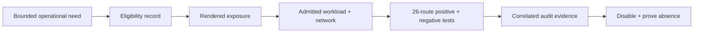

# Administrative endpoint exceptions

Atlas disables administrative endpoints by default in both Helm values and the
runtime. Enabling `server.adminEndpoints.enabled` registers all 26 routes as one
group; the switch does not provide authentication, authorization, isolation, or
per-route selection.

## Registered surface

- dataset and service diagnostics: `/debug/datasets`,
  `/debug/dataset-health`, `/debug/registry-health`, `/debug/diagnostics`,
  `/debug/runtime-stats`, `/debug/system-info`, `/debug/build-metadata`
- configuration and query diagnostics: `/debug/runtime-config`,
  `/debug/dataset-registry`, `/debug/shard-map`,
  `/debug/query-planner-stats`, `/debug/cache-stats`
- cluster control: `/debug/cluster/nodes`, `/debug/cluster-status`,
  `/debug/cluster/register`, `/debug/cluster/heartbeat`, `/debug/cluster/mode`
- replica control: `/debug/cluster/replicas`,
  `/debug/cluster/replicas/health`, `/debug/cluster/replicas/failover`,
  `/debug/cluster/replicas/diagnostics`
- recovery and fault control: `/debug/recovery/run`,
  `/debug/recovery/diagnostics`, `/debug/failure-injection`, `/debug/chaos/run`
- echo: `/v1/_debug/echo`

## Unresolved authorization gap

The runtime classifier recognizes 18 of these 26 routes. Four replica routes,
both recovery routes, failure injection, and chaos execution receive ordinary
`dataset.read` classification rather than `ops.admin`.

Recognized routes receive the embedded `operator` principal after configured
authentication checks. This does not establish that an external identity
provider asserted an operator role. Keep the group disabled for
security-qualified profiles until route registration and authorization agree.

## Exception proof

| Boundary | Acceptance condition |
| --- | --- |
| registration | Observed route set matches the runtime release |
| classification | Every route has intended exemption, action, resource, and principal treatment |
| exposure | Only the named operator path and sources can reach the service |
| authorization | Permitted and forbidden cases are tested for every reachable route |
| audit | Use and denial bind to request, policy, runtime, and operator identity |
| removal | Flag, workload, Service, ingress, network policy, and probes show closure |

A network-isolated but misclassified route remains a policy defect. A denied
request without audit remains an evidence gap. Registry removal with reachable
routes remains active exposure.

## Registry limits

`ops/k8s/admin-endpoints-exceptions.json` currently has no entries. Its schema
records only:

| Field | Meaning |
| --- | --- |
| `profile` | Exact profile eligible for the exception |
| `owner` | Accountable owner for removal or renewal |
| `expiresOn` | Policy deadline in `YYYY-MM-DD` form |

The record does not contain reason, route, release, cluster, namespace,
controls, or evidence. Treat it as eligibility metadata, not a complete
approval or exposure receipt.

## Bind one activation

| Receipt field | Required identity |
| --- | --- |
| executable | Runtime image digest and registered-route inventory hash |
| deployment | Cluster, namespace, release, profile, workload revision, and pod identities |
| reachability | Service, ingress or port-forward, network policy, and allowed source identities |
| authorization | Authentication mode, policy revision, allowed principal, and denied principals |
| custody | Need, activation time, operator, owner, expiry, and scheduled removal |
| observation | Request, denial, audit, and route-absence evidence |

Changing runtime, route set, target, profile, network, or authorization policy
requires a new binding even if registry fields remain schema-valid.

## Expiry and removal

`expiresOn` is a policy deadline, not a runtime kill switch. Before it arrives,
the owner must have a values change, rollout window, removal owner, exposure
recheck, and probes proving that all 26 routes are absent. Alert on:

- an enabled route group with no eligible registry entry;
- a passed expiry while routes remain enabled;
- an entry whose named profile is not the deployed profile;
- lost parity between registration and authorization inventories.

Expiry without timely renewal requires disabling exposure first. Extending a
date without fresh reachability, authorization, audit, and need evidence turns
an exception into permanent access.

## Authorities

- `ops/k8s/admin-endpoints-exceptions.json`
- `ops/schema/k8s/admin-endpoints-exceptions.schema.json`
- `ops/k8s/charts/bijux-atlas/values.yaml`
- `ops/k8s/charts/bijux-atlas/templates/configmap.yaml`
- `ops/k8s/profile-security-contract.json`
- `crates/bijux-atlas-server/src/adapters/inbound/http/router.rs`

See [Identity, Authorization, and Audit](../security/identity-authorization-and-audit.md)
for request-decision evidence.
