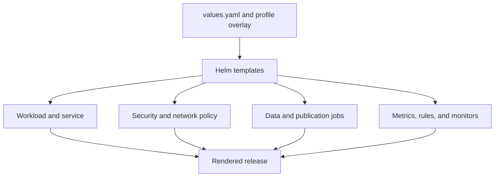

# Atlas Helm Chart

The Atlas Helm chart packages the HTTP service, runtime configuration,
security boundaries, scaling controls, data preparation, and observability
wiring as one application release. The current chart declares Kubernetes
`>=1.26.0-0`.

## Resource Ownership

The authored chart lives at `ops/k8s/charts/bijux-atlas/`:

| Surface | Templates | Operational effect |
| --- | --- | --- |
| Runtime | `deployment.yaml`, `rollout.yaml`, `configmap.yaml` | Process command, environment, probes, lifecycle, and rollout strategy |
| Traffic | `service.yaml`, `ingress.yaml` | Cluster and ingress exposure |
| Capacity | `hpa.yaml`, `pdb.yaml` | Autoscaling and voluntary-disruption limits |
| Security | `networkpolicy.yaml`, `secret.yaml`, `audit-log-rbac.yaml` | Network reachability, credentials, and audit permissions |
| Storage | `pvc.yaml`, `audit-pvc.yaml` | Cache and audit persistence when enabled |
| Data preparation | `dataset-warmup-job.yaml`, `catalog-publish-job.yaml` | Dataset prewarming and catalog publication |
| Observability | `servicemonitor.yaml`, `prometheusrule.yaml`, `prometheusrecordingrule.yaml` | Scraping, alerts, and recording rules |

`_helpers.tpl` owns common names and labels. `NOTES.txt` owns post-install
operator guidance. A new resource must have a clear operational owner and
conformance coverage; it should not be hidden in a generic template.

## Authored Inputs and Derived Evidence

Three authored inputs determine a render:

- `Chart.yaml` defines package identity, application version, and Kubernetes
  compatibility;
- `values.yaml` defines the baseline configuration contract;
- `values.schema.json` rejects unknown keys, invalid types, and prohibited
  cross-field combinations.

Profile overlays under `ops/k8s/values/` select an environment shape. Files
under `ops/k8s/generated/` are derived inventories and release snapshots. Edit
the chart or profile that owns the intent, then regenerate evidence; never
patch generated output to change the desired release.

## Render Invariants

A chart change is ready for installation only when:

- baseline values still validate against the schema;
- every affected supported profile renders successfully;
- names, selectors, ports, labels, and service accounts agree across resources;
- security contexts and network policy preserve the selected profile's
  contract;
- probes, grace periods, disruption budgets, and rollout behavior form a
  coherent lifecycle;
- enabled monitoring resources match emitted metrics and existing rule names;
- data jobs use the same image, identity, store, and catalog configuration as
  the service they prepare.

Helm rendering proves the manifest shape. It does not prove that the image
starts, dependencies are reachable, readiness becomes true, or an upgrade is
safe. Those claims require conformance and live operational evidence.

## Review Failure Signals

Block a chart change when it introduces an undeclared values key, changes a
selector without its consumer, weakens a security context, enables a privileged
surface by default, or creates a resource without a matching validation route.
Also block a change whose only evidence is a hand-edited generated snapshot.

Continue with [Helm Values Model](helm-values-model.md) for configuration
semantics and [Render and Validate](render-and-validate.md) for the proof path.
