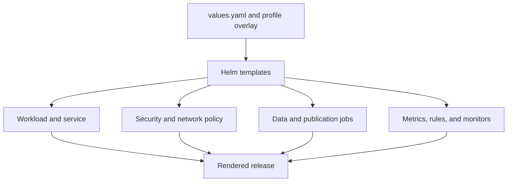
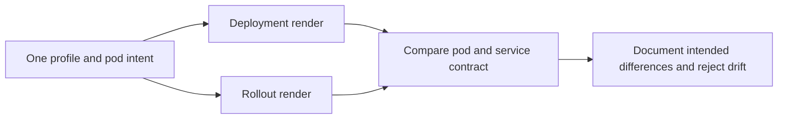
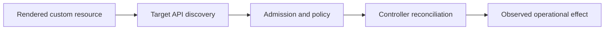

# Atlas Helm Chart

The Atlas Helm chart packages the HTTP service, runtime configuration,
security boundaries, scaling controls, data preparation, and observability
wiring as one application release. The current chart declares Kubernetes
`>=1.26.0-0`.

## Resource Ownership

The authored chart lives at `ops/k8s/charts/bijux-atlas/`:

| Surface | Templates | Operational effect |
| --- | --- | --- |
| Runtime | `deployment.yaml`, `rollout.yaml`, `configmap.yaml` | Process command, environment, probes, lifecycle, and rollout strategy |
| Traffic | `service.yaml`, `ingress.yaml` | Cluster and ingress exposure |
| Capacity | `hpa.yaml`, `pdb.yaml` | Autoscaling and voluntary-disruption limits |
| Security | `networkpolicy.yaml`, `secret.yaml`, `audit-log-rbac.yaml` | Network reachability, credentials, and audit permissions |
| Storage | `pvc.yaml`, `audit-pvc.yaml` | Cache and audit persistence when enabled |
| Data preparation | `dataset-warmup-job.yaml`, `catalog-publish-job.yaml` | Dataset prewarming and catalog publication |
| Observability | `servicemonitor.yaml`, `prometheusrule.yaml`, `prometheusrecordingrule.yaml` | Scraping, alerts, and recording rules |

`_helpers.tpl` owns common names and labels. `NOTES.txt` owns post-install
operator guidance. A new resource must have a clear operational owner and
conformance coverage; it should not be hidden in a generic template.

## Authored Inputs and Derived Evidence

Three authored inputs determine a render:

- `Chart.yaml` defines package identity, application version, and Kubernetes
  compatibility;
- `values.yaml` defines the baseline configuration contract;
- `values.schema.json` rejects unknown keys, invalid types, and prohibited
  cross-field combinations.

Profile overlays under `ops/k8s/values/` select an environment shape. Files
under `ops/k8s/generated/` are derived inventories and release snapshots. Edit
the chart or profile that owns the intent, then regenerate evidence; never
patch generated output to change the desired release.

## Render Invariants

A chart change is ready for installation only when:

- baseline values still validate against the schema;
- every affected supported profile renders successfully;
- names, selectors, ports, labels, and service accounts agree across resources;
- security contexts and network policy preserve the selected profile's
  contract;
- probes, grace periods, disruption budgets, and rollout behavior form a
  coherent lifecycle;
- enabled monitoring resources match emitted metrics and existing rule names;
- data jobs use the same image, identity, store, and catalog configuration as
  the service they prepare.

Helm rendering proves the manifest shape. It does not prove that the image
starts, dependencies are reachable, readiness becomes true, or an upgrade is
safe. Those claims require conformance and live operational evidence.

## Review Failure Signals

Block a chart change when it introduces an undeclared values key, changes a
selector without its consumer, weakens a security context, enables a privileged
surface by default, or creates a resource without a matching validation route.
Also block a change whose only evidence is a hand-edited generated snapshot.

## Activation and Absence Contract

Values control both fields and object existence. Review the activation edge,
not only the emitted object:

| Capability | Enabling intent | Expected rendered evidence | Required absence when disabled |
| --- | --- | --- | --- |
| ingress | ingress profile and host/TLS values | Ingress, Service target, annotations, and certificate references | no externally routable Ingress object |
| autoscaling | HPA policy and metric configuration | HPA target, limits, metrics, and compatible replica policy | no stale HPA controlling the workload |
| disruption protection | availability and maintenance policy | PDB selector and allowed disruption | no orphan PDB selecting another release |
| network confinement | profile security policy | ingress and egress NetworkPolicy matching selected pods | no unrestricted policy branch in restricted profiles |
| persistent audit | audit storage and retention intent | PVC, mount, permissions, retention, and recovery identity | no writable audit volume or unused privilege grant |
| dataset preparation | warmup or catalog publication intent | job image, configuration, store identity, deadline, and cleanup | no preparation job mutating an unselected catalog |
| monitoring | scrape and rule intent | ServiceMonitor, rule objects, ports, and release labels | no rules querying metrics the profile does not emit |

An absent protective object is often more important than a malformed present
object. Profile review must include explicit negative assertions and resource
counts.

## Workload Controller Equivalence

The chart can render a Deployment or an Argo Rollout. Those controllers must
carry the same product contract unless a documented rollout capability requires
a difference.

Compare image digest, command, environment, ConfigMap and Secret references,
service account, security context, probes, ports, resources, volumes,
scheduling, lifecycle hooks, termination grace, and telemetry labels. A
controller switch must not silently change dataset, authorization, drain, or
observability behavior.

Retain both rendered inventories when changing shared helpers or pod fields.
Testing only the controller selected by the default values leaves the alternate
production path unqualified.

## Account for Extension APIs

Most chart objects use built-in Kubernetes APIs, but three template families
depend on APIs supplied by other controllers. Their successful Helm render is
not evidence that the target cluster can admit or reconcile them.

| Chart object | External capability | Required target evidence |
| --- | --- | --- |
| `Rollout` | Argo Rollouts CRD and controller | served API version, controller identity, reconciliation status, and rollback behavior |
| `ServiceMonitor` | Prometheus Operator CRD and controller | admitted object, selected Service, discovered target, and successful scrape |
| `PrometheusRule` | Prometheus Operator CRD and rule evaluator | admitted object, loaded rule status, query validity, and alert delivery path |

Record each required group, version, and kind in the target capability receipt.
When a capability is intentionally absent, the selected values must suppress
its objects or the installation must fail before mutation. A cluster accepting
an unserved or unreconciled custom resource cannot be treated as a degraded
success: the workload, telemetry, or rollout contract is incomplete.

Continue with [Helm Values Model](helm-values-model.md) for configuration
semantics and [Render and Validate](render-and-validate.md) for the proof path.
