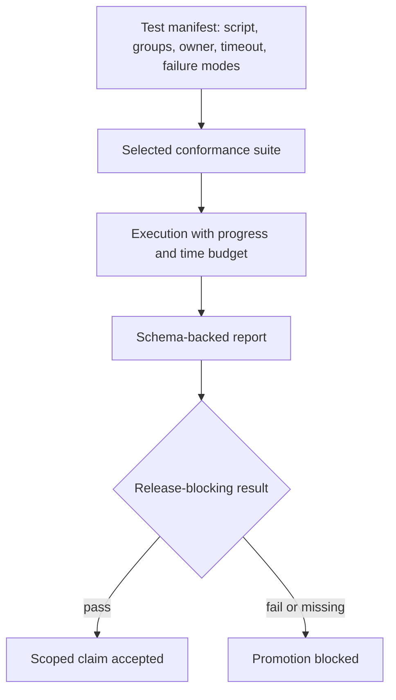

# Kubernetes Conformance Suites

Atlas conformance tests connect rendered resources to observable behavior. The
test manifest currently contains 79 checks owned across chart, server, store,
observability, and stack domains.

## Evidence Layers

`manifest.json` owns individual checks. `suites.json` selects checks by group.
`ownership.json` routes failures. The conformance report schema defines the
machine-readable result.

## Evidence Identity

A governed conformance result binds all of these identities:

- suite and manifest revision;
- selected check IDs and groups;
- source revision, runtime, image, chart, and profile;
- cluster, namespace, and relevant dependency versions;
- start, end, timeout, retry, and quarantine state;
- section results, raw output locations, and owning domain; and
- final verdict plus any evidence gaps.

Without the selected check inventory, a suite name cannot show what ran.
Without release and environment identity, a passing report cannot support the
deployment under review.

## Suite Catalog

| Suite | Groups and operating question | Budget |
| --- | --- | ---: |
| `smoke` | install, readiness, sanity, autoscaling, PDB, and observability wiring | 10 min |
| `resilience` | availability, autoscaling, PDB, rolling restart, and resilience | 20 min |
| `graceful-degradation` | load, readiness, and resilience during cached-only or store failure | not declared |
| `api-protection` | admission control, rate limiting, and Redis-backed protection | not declared |
| `full` | every declared test group | 60 min |

Smoke and resilience fail fast. Full requires progress logs. A missing budget
does not grant unlimited execution; it means the suite registry currently does
not declare one and the run record must state the applied outer limit.

The `install-gate`, `k8s-suite`, and `nightly` names in the install matrix are
broader delivery lanes. They are not entries in this five-suite conformance
catalog. Record both the delivery lane and the conformance suite when both are
part of the evidence.

## What a Report Proves

A conformance pass proves only the checks selected by that suite and manifest
revision. The report must identify its run and suite, give a top-level status,
list failed sections, and preserve section results for configuration, policy,
probes, PDB, and observability or other selected groups.

Before relying on a pass, confirm:

- the changed resource is covered by at least one selected test;
- the manifest expected failure mode matches the risk under review;
- the owner is still correct;
- retries did not conceal a persistent failure;
- the report validates against
  `ops/schema/k8s/conformance-report.schema.json`;
- required progress and timeout behavior was preserved.

## Failure Taxonomy

| Failure | Interpretation |
| --- | --- |
| assertion | observed behavior violated the selected contract |
| timeout | the check did not establish a verdict inside its budget |
| setup | the environment could not reach the intended starting state |
| capability | a required executable, network, or cluster operation was unavailable |
| telemetry | required evidence could not be captured or correlated |
| quarantine-policy | the check disposition is expired, ownerless, or issue-less |
| report | the result is absent, incomplete, or schema-invalid |

Only an assertion failure directly establishes a behavior violation. The other
classes still block the scoped conformance claim because the required evidence
was not obtained.

## Current Quarantine Risk

The manifest's flake policy requires an issue and limits quarantine to 14 days.
Four checks currently carry `quarantine_until: 2026-03-31` without an issue
field: catalog refresh readiness, readiness semantics, JSON logging, and store
reachability. As of this review, those entries are expired and do not satisfy
the declared quarantine policy.

Do not count an expired quarantine as passing evidence. Restore the check or
record a current issue-backed disposition before using a suite result for
release confidence.

## Failure Decisions

Block promotion when a required test is missing, a selected check fails, a
report is absent or schema-invalid, quarantine policy is violated, or ownership
is unknown. A passing script outside the declared manifest is useful diagnosis,
but it is not governed conformance evidence.

The executable inventory is under `ops/k8s/tests/`; the sample evidence shape is
`ops/k8s/tests/goldens/k8s-conformance-report.sample.json`.
