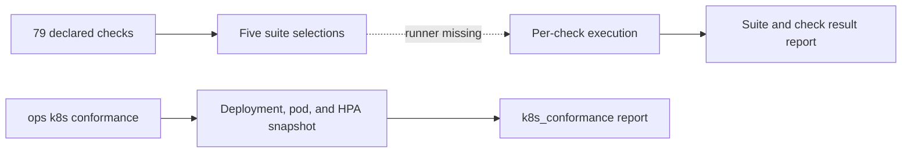

# Kubernetes Conformance Suites

Atlas declares a Kubernetes check catalog with 79 entries and five suite
selections. That catalog is a coverage design, not current end-to-end execution
evidence. The implemented `ops k8s conformance` command is a narrower
workload-readiness snapshot and does not select or run the catalog entries.

## Evidence Layers

`manifest.json` owns intended check metadata. `suites.json` selects checks by
group. `ownership.json` declares failure routing. The conformance report schema
accepts generic named sections, but the current command emits only a
`workload_readiness` section with `suite_id: k8s_conformance`.

## Implemented Command

The current command:

1. reads deployments and pods from the fixed `bijux-atlas` namespace through
   `kubectl`;
2. fails when a deployment has fewer ready replicas than desired;
3. fails when a pod phase is neither `Running` nor `Succeeded`;
4. checks for a custom metrics API only when an HPA object is present; and
5. optionally writes `ops/k8s/generated/conformance-report.json`.

It does not load `manifest.json`, select a suite from `suites.json`, invoke the
declared scripts, enforce suite budgets or fail-fast policy, evaluate
quarantines, or emit per-check results. Its pass supports a workload-readiness
claim only.

## Required Suite Evidence

A future or external suite execution is usable only when it binds:

- suite and manifest revision;
- selected check IDs and groups;
- source revision, runtime, image, chart, and profile;
- cluster, namespace, and relevant dependency versions;
- start, end, timeout, retry, and quarantine state;
- section results, raw output locations, and owning domain; and
- final verdict plus any evidence gaps.

Without the selected check inventory, a suite name cannot show what ran.
Without release and environment identity, a passing report cannot support the
deployment under review. The current `k8s_conformance` report does not contain
these identities and must not be promoted into a full-suite result.

## Suite Catalog

| Suite | Groups and operating question | Budget |
| --- | --- | ---: |
| `smoke` | install, readiness, sanity, autoscaling, PDB, and observability wiring | 10 min |
| `resilience` | availability, autoscaling, PDB, rolling restart, and resilience | 20 min |
| `graceful-degradation` | load, readiness, and resilience during cached-only or store failure | not declared |
| `api-protection` | admission control, rate limiting, and Redis-backed protection | not declared |
| `full` | every declared test group | 60 min |

These are declared policies. `smoke` and `resilience` request fail-fast, and
`full` requests progress logs. A missing budget does not grant unlimited
execution; it means the suite registry does not declare one. None of these
policies is enforced by the current readiness command.

The `install-gate`, `k8s-suite`, and `nightly` names in the install matrix are
broader delivery lanes. They are not entries in this five-suite conformance
catalog. Record both the delivery lane and the conformance suite when both are
part of the evidence.

## Claim Matrix

| Evidence | Safe claim | Unsafe claim |
| --- | --- | --- |
| valid manifest and suites files | check metadata and grouping satisfy their configuration contract | any check ran |
| passing `ops k8s conformance` report | observed deployments and pods met its readiness rules; HPA metrics API was present when checked | any named catalog suite passed |
| individual script output | that script observed its recorded target | selected suite completeness |
| per-check report bound to selected manifest and suite | recorded checks produced the stated results | another profile or release behaves the same |

Before relying on a suite pass, confirm the changed resource is covered by a
selected check, every selected check has a result, budgets and quarantine rules
were applied, the report validates against its schema, and source, release,
profile, cluster, and tool identities agree.

## Failure Taxonomy

| Failure | Interpretation |
| --- | --- |
| assertion | observed behavior violated the selected contract |
| timeout | the check did not establish a verdict inside its budget |
| setup | the environment could not reach the intended starting state |
| capability | a required executable, network, or cluster operation was unavailable |
| telemetry | required evidence could not be captured or correlated |
| quarantine-policy | the check disposition is expired, ownerless, or issue-less |
| report | the result is absent, incomplete, or schema-invalid |

Only an assertion failure directly establishes a behavior violation. The other
classes still block the scoped conformance claim because required evidence was
not obtained. The current readiness command reports errors but does not encode
this full taxonomy.

## Current Quarantine Risk

The manifest's flake policy requires an issue and limits quarantine to 14 days.
Four checks currently carry `quarantine_until: 2026-03-31` without an issue
field: catalog refresh readiness, readiness semantics, JSON logging, and store
reachability. As of this review, those entries are expired and do not satisfy
the declared quarantine policy.

Do not count an expired quarantine as passing evidence. Restore the check or
record a current issue-backed disposition before using a suite result for
release confidence.

## Promotion Boundary

Block any claim of full Kubernetes conformance until a runner selects the
catalog entries, invokes them, applies budgets and quarantine policy, and emits
identity-bound per-check results. The readiness command remains useful and
should continue to block when its snapshot fails, but it cannot close the
catalog execution gap.

Authorities:

- declared checks: `ops/k8s/tests/manifest.json`
- suite selections: `ops/k8s/tests/suites.json`
- failure ownership: `ops/k8s/tests/ownership.json`
- report schema: `ops/schema/k8s/conformance-report.schema.json`
- implemented readiness command:
  `crates/bijux-atlas-ops/src/kubernetes/conformance.rs`
- emitted report builder:
  `crates/bijux-atlas-ops/src/kubernetes/conformance_report.rs`
