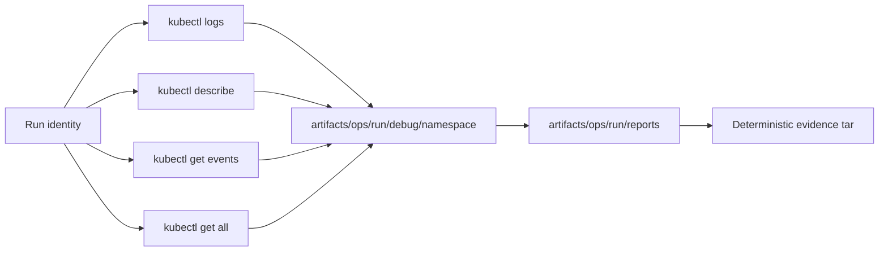

# Debug Bundles

Atlas preserves Kubernetes diagnostics under one run identity so another
operator can inspect the failure after the cluster has changed. The current
collector is Kind-specific and produces category reports plus captured files;
it is not a generic multi-cluster support archive.

## Capture Model

Each collection action writes one captured file and one schema-shaped report:

| Category | Collection | Default file |
| --- | --- | --- |
| `logs` | deployment logs, last 500 lines | `pod-logs.txt` |
| `describe` | Deployment and Service descriptions | `describe.txt` |
| `events` | namespace events sorted by creation time | `events.txt` |
| `resources` | `kubectl get all` in YAML | `resources.yaml` |

Reports are written as
`artifacts/ops/<run-id>/reports/ops-debug-bundle-<category>.json`; captured data
lives below `artifacts/ops/<run-id>/debug/<namespace>/`. The lifecycle evidence
builder can package the run's `reports/` and `debug/` trees into a deterministic
tar with normalized metadata.

## Report Contract

`ops-debug-bundle.schema.json` requires:

- `schema_version: 1`
- `cluster: kind`
- a non-empty `namespace`
- one category from `logs`, `describe`, `events`, or `resources`
- `status` of `ok` or `failed`
- at least one path in `files`

The report records collection status and file membership. It does not record a
source revision, cluster context, capture timestamp, checksums, redaction
result, or incident identifier. Preserve those associations in the surrounding
run evidence; do not infer them from this schema.

## Capture Before State Disappears

Collect diagnostics before restarting pods, changing a rollout, or deleting a
namespace. Events and logs are perishable. At minimum:

1. capture the failing workload logs
2. describe the Deployment and Service
3. capture namespace events
4. snapshot namespace resources
5. retain the report that triggered collection
6. build the lifecycle evidence archive under the same run identity

The `resources` action uses `kubectl get all`; Kubernetes does not include every
namespaced resource in that alias. Capture ConfigMaps, NetworkPolicies,
Ingresses, PVCs, or custom resources separately when they matter to the
incident.

## Sensitive Data Boundary

The collector writes command output as received. It does not perform automatic
redaction. Before sharing or attaching a bundle:

- inspect environment values, annotations, URLs, headers, and log payloads
- exclude Secrets and credential-bearing custom resources
- preserve enough structure to diagnose the failure without retaining tokens
  or personal data
- record that redaction occurred outside the bundle report, because the current
  schema has no redaction field

An unreviewed bundle is local diagnostic material, not distributable incident
evidence.

## Completeness and Failure Semantics

A category report with `status: ok` means that collection action returned and
the file was written. It does not mean the incident is explained, all four
categories exist, or the evidence archive was built. Conversely, a failed
collection attempt should remain visible; replacing it with an empty successful
report destroys the reason the evidence is incomplete.

## Authorities

- `ops/schema/k8s/ops-debug-bundle.schema.json`
- `crates/bijux-atlas-ops/src/lifecycle/simulation/debug_collection.rs`
- `crates/bijux-atlas-ops/src/lifecycle/evidence/artifacts.rs`
- `ops/k8s/tests/goldens/k8s-conformance-report.sample.json`
