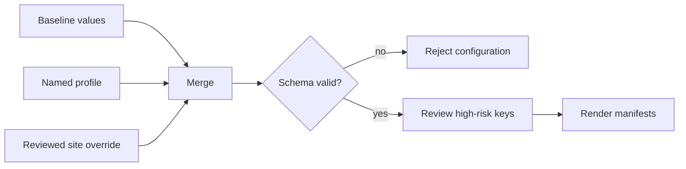

# Helm Values Model

Atlas configuration is layered. Baseline values define the complete chart
surface, a named profile expresses deployment intent, and a schema enforces the
relationships that must remain true in every render.

## Configuration Resolution

Keep site-specific overrides separate from governed profiles. Editing a shared
profile to accommodate one cluster silently changes the meaning of every run
that uses that profile.

## Profile Contracts

`ops/k8s/values/profiles.json` records purpose, risk, intended use, required and
forbidden toggles, resource class, network policy, HPA policy, image pinning,
filesystem posture, debug posture, and storage mode.

| Profile family | Intended contract |
| --- | --- |
| `profile-baseline` | Minimal common chart behavior with read-only filesystem and ephemeral storage |
| `ci` | Fast cached-only validation without dependency egress or autoscaling |
| `kind` | Realistic local-cluster dependency wiring with ephemeral storage |
| `offline` | Prewarmed, cached-only operation without live dependency egress |
| `perf` | Digest-pinned load environment with HPA, metrics, and dependency-aware policy |
| `prod` | Primary production shape with autoscaling and dependency isolation |
| `prod-minimal` | Small production-safe shape with digest pinning and HPA |
| `prod-ha` | Multiple replicas, disruption protection, tighter probes, and HPA |
| `prod-airgap` | Disconnected production using a local registry and pinned dataset assets |

The install matrix governs a smaller set of executable installation paths.
Presence in the profile registry does not automatically mean a profile has an
install, upgrade, and rollback scenario.

## Schema-Enforced Relationships

The values schema uses strict objects and cross-field rules. Important examples
include:

- cached-only mode requires catalog readiness to be disabled;
- init prewarming requires at least one pinned dataset;
- cluster-aware egress requires at least one allowed namespace;
- selected ingress requires an allowed namespace;
- custom network modes require explicit custom rules;
- container security forbids privilege escalation, requires a read-only root
  filesystem, and drops all Linux capabilities.

Invalid combinations must fail before installation. An operator warning is not
an adequate substitute for a relationship the schema can enforce.

## High-Risk Values

The high-risk policy names nine top-level areas:

`image`, `server`, `cache`, `store`, `resources`, `metrics`, `networkPolicy`,
`serviceAccount`, and `rbac`.

Review these values by consequence:

- image changes affect provenance, compatibility, and rollback identity;
- server and cache changes affect readiness, overload, and degraded operation;
- store changes affect data reachability, credentials, and integrity;
- resource changes affect scheduling, scaling, and performance baselines;
- metrics changes affect alert and release evidence;
- network policy, service account, and RBAC changes alter the security boundary.

## Operator Review

For any values change, record the selected profile, final merged values, chart
and image identity, affected high-risk areas, and rendered diff. Then run the
suite declared by the install matrix. Production-oriented changes also require
security, rollout, observability, and recovery evidence.

Reject unknown keys, mutable production image tags, enabled debug endpoints,
unexplained policy relaxation, or overrides that contradict the profile's
required and forbidden toggles.

See [Install Matrix](install-matrix.md) to choose the evidence lane and
[Runtime Configuration](runtime-configuration.md) for values that become Atlas
process configuration. Before using a production-oriented overlay, apply the
identity, target-capability, resilience, and recovery gates in
[Production Qualification](production-qualification.md).
