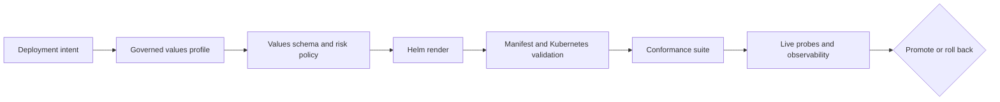
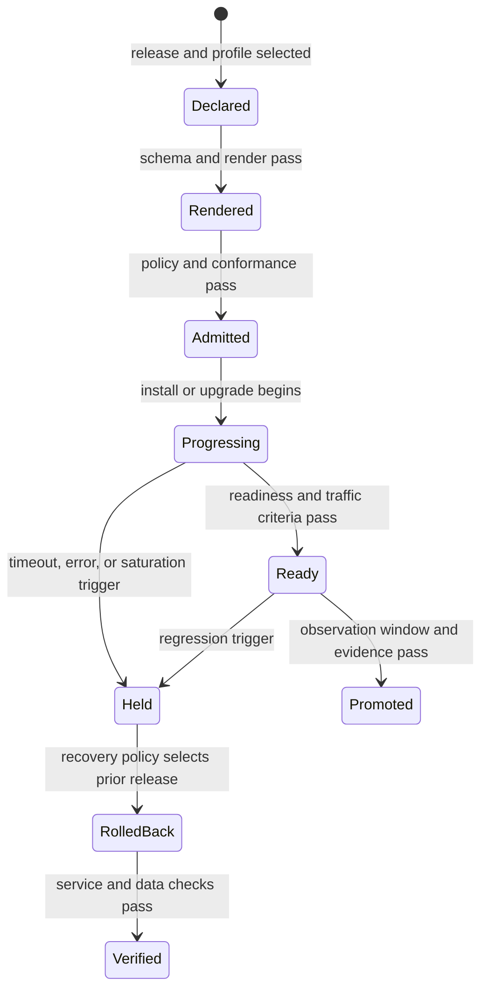
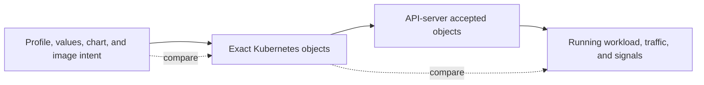

# Kubernetes Delivery

Atlas treats Kubernetes deployment as a chain of reviewable contracts. Chart
templates alone are not deployment evidence. A promotable result connects
profile intent, validated values, rendered resources, security posture,
rollout behavior, and conformance output.

## Deployment Proof Chain

Each layer narrows uncertainty. Schema validation rejects malformed or unsafe
input. Rendering exposes the actual objects. Conformance checks workload and
service shape. Live probes show whether the installed release admits traffic
and emits the required signals.

## Rollout State Model

`Rendered`, `Admitted`, `Ready`, and `Promoted` are distinct states. A render
report proves resource shape. Admission proves selected policy. Readiness
proves current traffic eligibility. Promotion additionally requires the named
observation and evidence policy for the environment.

## Desired, Rendered, and Observed State

| State | Identity to retain | Failure exposed |
| --- | --- | --- |
| desired | source revision, chart, image digest, profile, and values hashes | wrong release intent or unsupported combination |
| rendered | manifest hash, API capabilities, namespace, labels, selectors, and policy result | template, merge, security, or topology error |
| admitted | cluster, Kubernetes version, applied object revisions, and admission response | cluster policy or API incompatibility |
| observed | workload revision, pod images, effective configuration, dataset identity, and telemetry window | drift, startup, dependency, or behavioral failure |

A comparison must cross each boundary. Matching desired and rendered state does
not prove the cluster admitted those bytes. Matching rendered and live object
shape does not prove pods loaded the intended configuration or dataset.

## Traffic Eligibility Is Conditional

Readiness answers the probe contract configured for one instance. It does not
by itself prove release-wide capacity, correct routing, catalog freshness, or
telemetry continuity. Pair readiness with a governed request path, resolved
dataset identity, release-labeled signals, and the required observation window.

When readiness policy permits cached-only serving, record cache age and object
identity. Continued service from retained bytes is degraded continuity, not
evidence that new catalog state was discovered.

## Supported Deployment Paths

The install matrix currently maps ten profiles to three evidence lanes:

- `ci`, `dev`, and `local` use the focused `install-gate` suite;
- `kind`, `offline`, and `profile-baseline` use `k8s-suite`;
- `ingress`, `multi-registry`, `perf`, and `prod` use `nightly`.

Install scenarios cover the CI, Kind, offline, performance, and baseline
profiles. Upgrade and rollback scenarios are declared for Kind, offline, and
performance, with explicit previous-chart and workspace-head identities.

The matrix records supported evidence routes; it does not imply that every
profile has identical availability, security, or performance promises.

## Safety Boundaries

- Production-oriented profiles must run as non-root according to the profile
  security contract.
- Administrative endpoints remain disabled unless an explicit governed
  exception enables them; review the
  [Administrative Endpoints Exceptions](admin-endpoints-exceptions.md) ledger.
- Readiness, drain behavior, disruption budgets, and rollback triggers are
  delivery contracts, not tuning suggestions.
- Image digests, offline inputs, registries, namespaces, and dependency
  availability must match the selected profile.
- A successful template render is insufficient when conformance, probes, or
  security checks fail.

## Promotion Record

A Kubernetes promotion record should identify the chart and application
versions, image digests, values profile and overrides, namespace, rendered
inventory, policy and conformance results, rollout timestamps, probe history,
relevant telemetry window, and rollback target. Without those identities, a
green status cannot be reproduced or attributed to the release under review.

## Operator Route

1. Understand chart ownership in [Chart Layout](chart-layout.md).
2. Select and review configuration through
   [Helm Values Model](helm-values-model.md).
3. Confirm the supported evidence lane in [Install Matrix](install-matrix.md).
4. Produce inspectable manifests with
   [Render and Validate](render-and-validate.md).
5. Apply promotion and recovery rules from
   [Rollout Safety](rollout-safety.md).
6. Require the evidence described by
   [Conformance Suites](conformance-suites.md).
7. Verify [Security Operations](security-operations.md),
   [Runtime Configuration](runtime-configuration.md), and
   [Debug Bundles](debug-bundles.md) before production handoff.

## Contract Locations

- chart and baseline values: `ops/k8s/charts/bijux-atlas/`
- deployment profiles: `ops/k8s/values/`
- supported paths: `ops/k8s/install-matrix.json`
- rollout decisions: `ops/k8s/rollout-safety-contract.json`
- security posture: `ops/k8s/profile-security-contract.json` and the
  administrative-endpoint exception ledger
- executable conformance: `ops/k8s/tests/`

Keep the rendered manifests and reports with the release evidence. They are the
reviewable record of what Kubernetes was asked to run.
