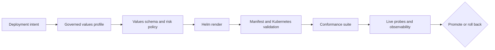

# Kubernetes Delivery

Atlas treats Kubernetes deployment as a chain of reviewable contracts. Chart
templates alone are not deployment evidence. A promotable result connects
profile intent, validated values, rendered resources, security posture,
rollout behavior, and conformance output.

## Deployment Proof Chain

Each layer narrows uncertainty. Schema validation rejects malformed or unsafe
input. Rendering exposes the actual objects. Conformance checks workload and
service shape. Live probes show whether the installed release admits traffic
and emits the required signals.

## Supported Deployment Paths

The install matrix currently maps ten profiles to three evidence lanes:

- `ci`, `dev`, and `local` use the focused `install-gate` suite;
- `kind`, `offline`, and `profile-baseline` use `k8s-suite`;
- `ingress`, `multi-registry`, `perf`, and `prod` use `nightly`.

Install scenarios cover the CI, Kind, offline, performance, and baseline
profiles. Upgrade and rollback scenarios are declared for Kind, offline, and
performance, with explicit previous-chart and workspace-head identities.

The matrix records supported evidence routes; it does not imply that every
profile has identical availability, security, or performance promises.

## Safety Boundaries

- Production-oriented profiles must run as non-root according to the profile
  security contract.
- Administrative endpoints remain disabled unless an explicit governed
  exception enables them; review the
  [Administrative Endpoints Exceptions](admin-endpoints-exceptions.md) ledger.
- Readiness, drain behavior, disruption budgets, and rollback triggers are
  delivery contracts, not tuning suggestions.
- Image digests, offline inputs, registries, namespaces, and dependency
  availability must match the selected profile.
- A successful template render is insufficient when conformance, probes, or
  security checks fail.

## Operator Route

1. Understand chart ownership in [Chart Layout](chart-layout.md).
2. Select and review configuration through
   [Helm Values Model](helm-values-model.md).
3. Confirm the supported evidence lane in [Install Matrix](install-matrix.md).
4. Produce inspectable manifests with
   [Render and Validate](render-and-validate.md).
5. Apply promotion and recovery rules from
   [Rollout Safety](rollout-safety.md).
6. Require the evidence described by
   [Conformance Suites](conformance-suites.md).
7. Verify [Security Operations](security-operations.md),
   [Runtime Configuration](runtime-configuration.md), and
   [Debug Bundles](debug-bundles.md) before production handoff.

## Contract Locations

- chart and baseline values: `ops/k8s/charts/bijux-atlas/`
- deployment profiles: `ops/k8s/values/`
- supported paths: `ops/k8s/install-matrix.json`
- rollout decisions: `ops/k8s/rollout-safety-contract.json`
- security posture: `ops/k8s/profile-security-contract.json` and the
  administrative-endpoint exception ledger
- executable conformance: `ops/k8s/tests/`

Keep the rendered manifests and reports with the release evidence. They are the
reviewable record of what Kubernetes was asked to run.
