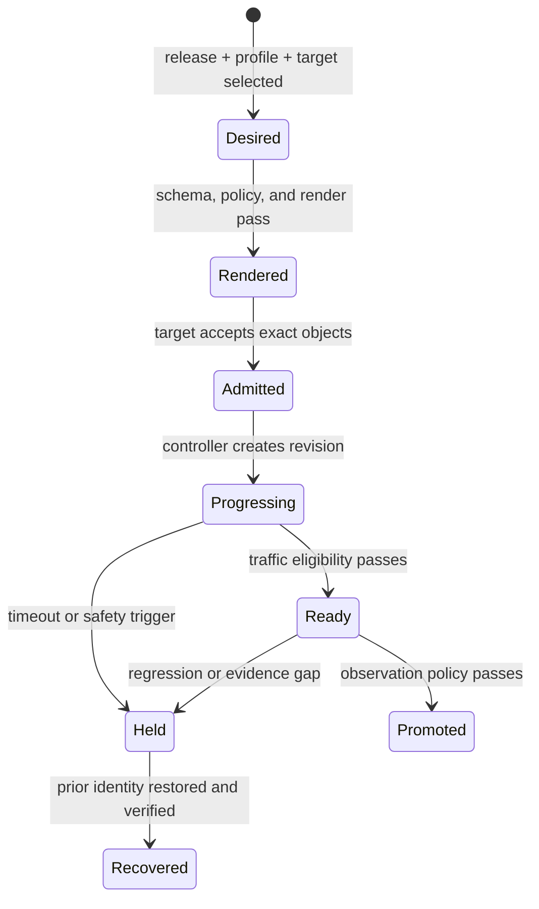
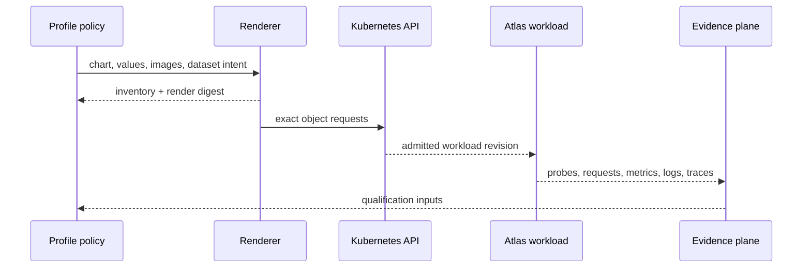

# Kubernetes delivery

Atlas treats Kubernetes delivery as a sequence of owned handoffs. A chart
render proves resource shape. API admission proves that a target accepted an
object request. Readiness describes a live snapshot. Promotion additionally
requires release-scoped correctness, capacity, security, telemetry, and
recovery evidence selected by the environment policy.

## Delivery state

| State | Identity to retain | Question answered |
| --- | --- | --- |
| desired | Source revision, chart, image digest, profile, values hashes, and target | What should run? |
| rendered | Manifest digest, object inventory, namespace, selectors, capabilities, and policy result | What exact resources would be requested? |
| admitted | Cluster, Kubernetes version, object revisions, and admission responses | What did this target accept? |
| ready | Workload revision, effective images and configuration, dataset identity, and probe history | Which instances currently admit traffic? |
| promoted | Observation window, governed checks, exceptions, decision owner, and rollback target | Why may this release serve? |

An identity-changing correction starts a new record. Do not reuse readiness or
telemetry after the manifest digest, workload revision, dataset selection, or
target changes.

## Handoffs and refusal conditions

| Handoff | Refuse continuation when |
| --- | --- |
| profile to render | The combination is unsupported, values are unknown, images are unpinned, or no rollback target exists |
| render to admission | Inventory, namespace, security, dependency, or target identity differs from intent |
| admission to workload | Pod spec, images, configuration, or routing differs from the admitted revision |
| workload to traffic | Readiness lacks required dataset, dependency, warmup, or drain semantics |
| traffic to promotion | Release-scoped correctness, saturation, security, or telemetry evidence is absent |

## Lock the target before effects

Kind-backed commands resolve the selected profile to an expected context and
verify the owned `bijux-atlas` namespace before cluster effects. A force
override grants explicit authority to cross that guard; it does not prove that
the alternate target is equivalent. Retained results must record the effective
context, namespace, command, run identity, and whether an override was used.

External clusters need an equally explicit target identity and authorization
policy. Context matching prevents one class of operator error; it does not
establish production ownership or workload correctness.

## Supported evidence lanes

The install matrix maps ten profiles to three lanes:

- `ci`, `dev`, and `local` use `install-gate`;
- `kind`, `offline`, and `profile-baseline` use `k8s-suite`;
- `ingress`, `multi-registry`, `perf`, and `prod` use `nightly`.

Install scenarios cover CI, Kind, offline, performance, and baseline profiles.
Upgrade and rollback scenarios are declared for Kind, offline, and performance
with explicit previous-chart and workspace-head identities. The matrix maps
supported routes; it does not give every profile the same availability,
security, or capacity promise.

## Conformance boundary

| Surface | Current scope | Safe conclusion |
| --- | --- | --- |
| `bijux-atlas-dev ops k8s conformance` | Deployment and pod readiness plus HPA metrics API availability | A point-in-time readiness snapshot completed |
| `ops/k8s/tests/manifest.json` and `suites.json` | 79 checks grouped into five suites | Intended check inventory and selection are declared |

No current runner connects a selected suite to all declared scripts and emits
per-check results. A generic conformance report therefore does not prove that
the `smoke`, `resilience`, `graceful-degradation`, `api-protection`, or `full`
suite completed. Name and bind every additional check actually used for a
promotion. [Conformance Suites](conformance-suites.md) carries the detailed
coverage contract.

## Operator route

| Decision | Read |
| --- | --- |
| Understand chart ownership | [Chart Layout](chart-layout.md) |
| Select configuration | [Helm Values Model](helm-values-model.md) |
| Choose a supported evidence lane | [Install Matrix](install-matrix.md) |
| Produce inspectable manifests | [Render and Validate](render-and-validate.md) |
| Control forward and reverse rollout | [Rollout Safety](rollout-safety.md) |
| Assemble environment gates | [Production Qualification](production-qualification.md) |
| Review exposure and confinement | [Security Operations](security-operations.md) |
| Attribute effective process settings | [Runtime Configuration](runtime-configuration.md) |
| Preserve investigation context | [Debug Bundles](debug-bundles.md) |

Keep render inventories, admission results, rollout events, probe history,
telemetry-window identity, and rollback evidence with the release packet. They
are the reviewable record of what Kubernetes was asked to run, what it
accepted, and why traffic or promotion was permitted.
