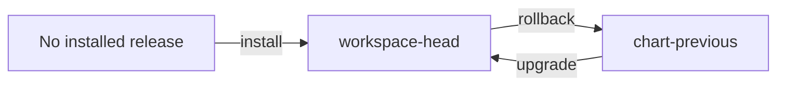

# Installation, Upgrade, and Rollback Matrix

The install matrix is the compatibility table for Kubernetes delivery. It binds
a values profile to the suite that must prove it, and it names the lifecycle
transitions Atlas actually exercises.

## Profile Evidence Lanes

| Profile | Values file | Required suite |
| --- | --- | --- |
| `ci` | `ops/k8s/values/ci.yaml` | `install-gate` |
| `dev` | `ops/k8s/values/dev.yaml` | `install-gate` |
| `local` | `ops/k8s/values/local.yaml` | `install-gate` |
| `kind` | `ops/k8s/values/kind.yaml` | `k8s-suite` |
| `offline` | `ops/k8s/values/offline.yaml` | `k8s-suite` |
| `profile-baseline` | `ops/k8s/values/profile-baseline.yaml` | `k8s-suite` |
| `ingress` | `ops/k8s/values/ingress.yaml` | `nightly` |
| `multi-registry` | `ops/k8s/values/multi-registry.yaml` | `nightly` |
| `perf` | `ops/k8s/values/perf.yaml` | `nightly` |
| `prod` | `ops/k8s/values/prod.yaml` | `nightly` |

This table states the minimum named lane. A production decision can require
additional security, load, observability, and recovery evidence even when the
matrix row is satisfied.

## Lifecycle Coverage

The matrix declares these scenarios:

| Lifecycle | Profiles | Source and target identity |
| --- | --- | --- |
| Install | `profile-baseline`, `ci`, `kind`, `offline`, `perf` | Clean installation of the selected profile |
| Upgrade | `kind`, `offline`, `perf` | `chart-previous` to `workspace-head` |
| Rollback | `kind`, `offline`, `perf` | `workspace-head` to `chart-previous` |

There is no declared upgrade or rollback scenario for `prod`, `dev`, `local`,
`ingress`, or `multi-registry` in the current matrix. Do not present those
transitions as proven by this contract.

## Selecting a Path

1. Choose a profile whose intent matches the target environment.
2. Confirm its values file and suite in `ops/k8s/install-matrix.json`.
3. Validate the matrix against `ops/schema/k8s/install-matrix.schema.json`.
4. For upgrade or rollback, preserve both release references and rendered
   manifests.
5. Run the named suite and collect the install, probe, conformance, and
   observability evidence it requires.
6. Apply rollout and rollback decisions using the rollout-safety contract.

## Honest Claims

A profile row proves that an evidence lane is defined. A passing install proves
that one selected release can be installed under that lane. It does not prove
upgrade compatibility, rollback recovery, capacity, air-gap completeness, or
production readiness unless those claims have their own declared scenario and
evidence.

When a real deployment path is missing from the matrix, add and validate the
contract before calling the path supported. Do not borrow evidence from a
different profile because its manifests appear similar.

Continue with [Render and Validate](render-and-validate.md) for preflight proof
and [Rollout Safety](rollout-safety.md) for live promotion decisions.
