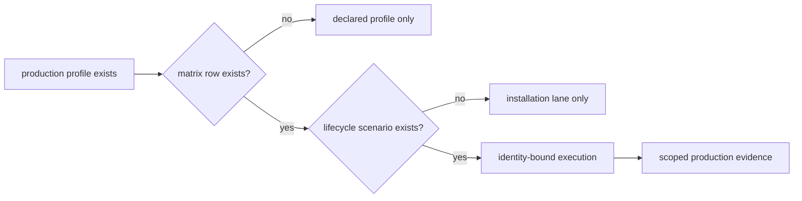
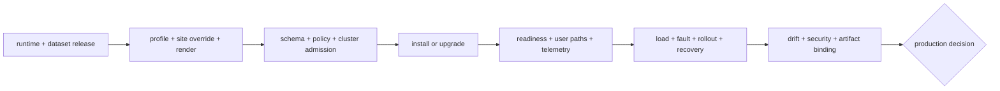

# Production Qualification

Production qualification joins release identity, rendered deployment policy,
live service behavior, resilience, and recovery into one attributable decision.
A production-named values file is deployment intent; it is not evidence that
the path was installed, upgraded, rolled back, or operated successfully.

## Production Profile Intent

Atlas carries four production-oriented overlays:

| Profile | Declared shape | Qualification emphasis |
| --- | --- | --- |
| `prod` | 3 replicas, HPA 3–20, rollout, cluster-aware network policy | general dependency-connected production |
| `prod-minimal` | 2 replicas, HPA 2–8, digest pinning | smaller fault domain and capacity margin |
| `prod-ha` | 4 replicas, HPA 4–16, PDB minimum 2, tighter probes | disruption and overlap behavior |
| `prod-airgap` | cached-only, prewarmed dataset, local registry, no HPA | offline asset and recovery completeness |

The overlays do not define institutional ingress, storage class, secret
provider, certificate authority, alert destination, backup target, or cluster
admission controller. Those site-owned controls must be added as reviewed
overrides and retained in the qualification record.

## Current Coverage Boundary

`ops/k8s/install-matrix.json` contains a `prod` profile row assigned to the
`nightly` delivery lane. It does not contain rows for `prod-minimal`, `prod-ha`,
or `prod-airgap`. The lifecycle scenario set has no install, upgrade, or
rollback scenario for any production profile.

The `prod-minimal`, `prod-ha`, and `prod-airgap` overlays contain repeated-digit
SHA-256 values. These are deterministic contract fixtures, not digests of a
released Atlas image. Replace them with an immutable, provenance-bound image
digest before rendering a candidate deployment.

`prod-airgap` also disables NetworkPolicy under a dated, owner-bearing profile
exception while disabling dependency egress. That expresses an air-gap model;
it does not prove cluster isolation. Qualification requires independent
reachability evidence for the target boundary and review of the exception at
decision time.

Do not borrow a Kind, offline, or performance lifecycle result for a production
profile merely because selected fields render similarly.

## Qualification Chain

Every link answers a different question:

| Gate | Required evidence |
| --- | --- |
| release | source revision, runtime digest, dataset tuple, manifest, and provenance |
| render | chart, profile, site override, merged-values digest, and inventory |
| admission | schema, high-risk policy, workload security, and stored-object result |
| install | lifecycle direction, previous and candidate identity, events, and hooks |
| service | endpoint membership, probes, representative queries, and telemetry |
| resilience | capacity, overload, churn, dependency failure, and rollback results |
| recovery | backup or rollback identity, restored state, and observation window |
| closure | drift result, exceptions, packet digest, reviewer, and verdict |

A later gate cannot repair missing identity from an earlier gate. For example,
a successful query does not establish which values were admitted, and a valid
rollback plan does not establish that reversal completed.

## Profile-Specific Proof

### `prod`

Prove autoscaling from the declared minimum while preserving cheap-path
availability, dependency reachability, and rollout capacity. Confirm that the
cluster-aware network policy permits only the selected dependencies and DNS.

### `prod-minimal`

Prove the smaller replica floor survives one unavailable replica and that HPA
growth does not exceed dependency, storage, or telemetry capacity. A two-pod
shape does not inherit the disruption claim of `prod-ha`.

### `prod-ha`

Prove PDB behavior, scheduler placement, rolling overlap, HPA interaction, and
quorum-independent dataset access. `minAvailable: 2` is intended state; an
eviction, node-loss, and rollout observation establishes its effect.

### `prod-airgap`

Prove the complete offline bill of materials, local registry resolution,
prewarmed dataset integrity, cached-only readiness, tool availability, time
source, telemetry destination, and recovery without network access. Verify
that every image, chart, dataset, checksum, SBOM, and verifier resolves locally.

## Target Capability Record

Record target facts that can change behavior without changing chart values:

- Kubernetes version and architecture;
- container runtime and registry resolution policy;
- ingress, NetworkPolicy, DNS, and service-mesh implementations;
- storage classes, volume semantics, snapshots, and encryption authority;
- autoscaling APIs, metrics freshness, scheduling constraints, and node pools;
- secret and certificate providers plus rotation behavior;
- telemetry, alert, backup, and recovery destinations.

Bind the record to the cluster and qualification window. A later platform
upgrade makes the affected evidence stale even if the Atlas revision is
unchanged.

## Production Decision Record

The final record states the supported profile, lifecycle direction, release and
dataset identities, target capability digest, executed checks and scenarios,
evidence gaps, exceptions, rollback target, reviewer, and validity window.

Use four verdicts: qualified, qualified with governed exceptions, rejected, or
incomplete. “Installed” and “running” are observations, not production
qualification verdicts.

Continue with [Helm Values Model](helm-values-model.md),
[Install Matrix](install-matrix.md), [Render and Validate](render-and-validate.md),
[Rollout Safety](rollout-safety.md), and
[Service Objectives and Error Budgets](../observability/service-objectives-and-error-budgets.md).
