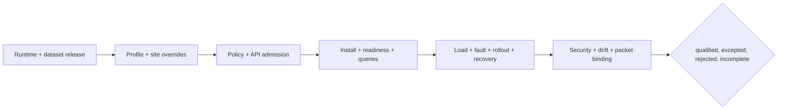
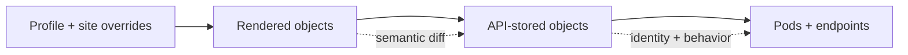

# Production qualification

Production qualification joins immutable release identity, target-admitted
deployment state, live service behavior, security, capacity, resilience, and
recovery into one attributable decision. A production-named values file is
intent, not proof that its lifecycle works.

## Declared profiles

| Profile | Declared shape | Qualification emphasis |
| --- | --- | --- |
| `prod` | 3 replicas, HPA 3–20, rolling deployment, cluster-aware network policy | Autoscaling and connected dependencies |
| `prod-minimal` | 2 replicas, HPA 2–8, digest requirement | Smaller disruption and capacity margin |
| `prod-ha` | 4 replicas, HPA 4–16, PDB minimum 2, tighter probes | Eviction, placement, and rolling overlap |
| `prod-airgap` | Cached-only, prewarmed dataset, local registry, no HPA | Complete offline bill of materials and recovery |

Site-owned ingress, storage, certificate, secret, alert, backup, and admission
controls are not defined by these overlays. Retain them as reviewed target
inputs.

## Current coverage boundary

The install matrix has a `prod` row in the `nightly` lane. It has no rows for
`prod-minimal`, `prod-ha`, or `prod-airgap`, and no production profile has an
install, upgrade, or rollback lifecycle scenario.

The three specialized overlays use repeated-digit SHA-256 contract fixtures,
not released Atlas image digests. Replace them with immutable,
provenance-bound candidates before rendering a real deployment.

`prod-airgap` disables NetworkPolicy under an owner- and date-bearing profile
exception. That describes a presumed air gap; it does not prove target
isolation. Independent reachability evidence remains mandatory.

Do not borrow Kind, offline, or performance lifecycle results for a production
profile because selected fields look similar.

## Qualification chain

| Gate | Required evidence |
| --- | --- |
| release | Source, runtime digest, dataset tuple, manifest, and provenance |
| render | Chart, profile, site overrides, merged-values digest, and inventory |
| admission | Policy result, stored objects, workload identity, and semantic delta |
| service | Endpoints, probes, representative queries, dataset identity, and telemetry |
| resilience | Capacity, overload, churn, dependency failure, and reversal results |
| recovery | Rollback or recovery identity, restored state, and observation window |
| closure | Drift, security, exceptions, evidence digest, owner, and verdict |

A later gate cannot repair missing identity from an earlier one.

## Prove admitted and effective state

Defaulting, mutation, sidecar injection, admission policy, and scheduling can
change security, resources, networking, identity, or shutdown behavior. The
semantic diff must preserve image digest, command, environment and secret
references, service account, security contexts, volumes, probes, resources,
scheduling, termination, labels, annotations, and network selectors.

Unexpected mutation of a claim-bearing field holds qualification. Bind the
admitted workload UID and template hash to the pods and endpoints actually
exercised.

## Profile-specific proof

- `prod`: prove scale-up from minimum replicas, dependency reachability, cheap
  route survival, and rollout capacity.
- `prod-minimal`: prove one unavailable replica and HPA growth stay within
  dependency, storage, and telemetry budgets.
- `prod-ha`: prove PDB enforcement, placement, eviction, rolling overlap, HPA
  interaction, and dataset access through disruption.
- `prod-airgap`: prove local resolution of every image, chart, dataset, SBOM,
  checksum, verifier, telemetry destination, time source, and recovery asset.

Record Kubernetes version, architecture, container runtime, registries,
networking, storage, autoscaling APIs, node pools, secret providers, telemetry,
alerts, backups, and recovery destinations. Platform change can stale this
evidence even when Atlas is unchanged.

The final record names profile, lifecycle direction, release, dataset, target,
executed checks, gaps, exceptions, rollback target, decision owner, and validity
window. “Installed” and “running” are observations, not qualification verdicts.

Continue with [Install Matrix](install-matrix.md),
[Render and Validate](render-and-validate.md), [Rollout Safety](rollout-safety.md),
and [Service Objectives and Error Budgets](../observability/service-objectives-and-error-budgets.md).
