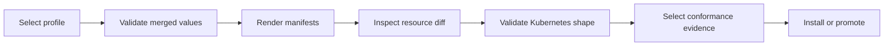
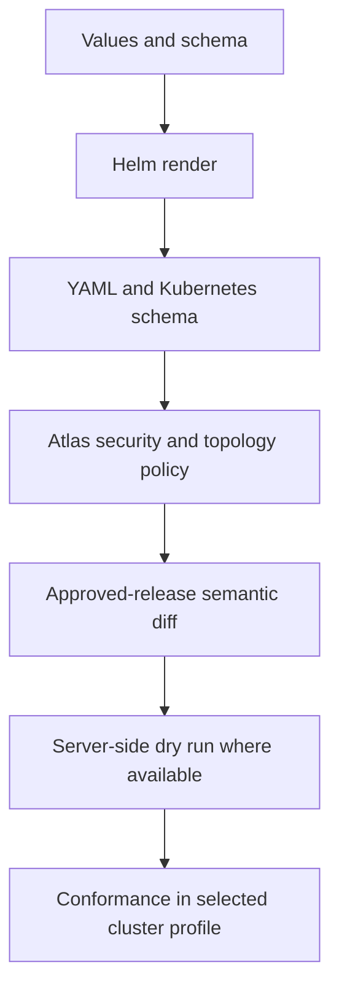

# Render and Validate a Deployment

Rendering turns values into the exact Kubernetes objects under review.
Validation asks whether those objects satisfy Atlas and Kubernetes contracts.
Neither step contacts a cluster unless the selected command explicitly does so.
Validation is layered. Each check has a bounded authority. Preserve every
failure instead of relying on a later, broader-looking success.

## Preflight Sequence



Use one profile, chart identity, image identity, and run ID throughout the
sequence. Re-rendering with different inputs between validation and install
invalidates the evidence chain.

## Control-Plane Commands

Inspect the command and render the Kind profile without applying it:

```bash
bijux-atlas-dev --repo-root "$PWD" ops render \
  --profile kind \
  --target helm \
  --check \
  --allow-subprocess \
  --format json
```

Validate the selected operational profile:

```bash
bijux-atlas-dev --repo-root "$PWD" ops validate \
  --profile kind \
  --allow-subprocess \
  --format json
```

The control plane requires subprocess permission to invoke Helm or another
external validator. Writing reports or governed output requires a separate
write capability. Grant only the effects the selected operation needs.

## Inspect the Rendered Release

Review the rendered objects as a connected system:

- the Deployment or Rollout uses the expected image digest and command;
- ConfigMap keys match the runtime configuration contract;
- Service ports, probe paths, container ports, and metric ports agree;
- selectors and labels connect workloads, Services, monitors, and policies;
- security contexts preserve non-root, read-only filesystem, and dropped
  capability requirements;
- NetworkPolicy allows only the dependencies selected by the profile;
- HPA, PDB, replica count, and rollout strategy do not contradict one another;
- warmup, catalog publication, storage, and audit resources appear only when
  their values enable them.

Use a resource-level diff against the approved release for upgrade and rollback
review. A summary that hides deleted policy, probe, or identity fields is not
sufficient.

## Assert Presence and Absence

A review is incomplete if it checks only the objects that exist. Values can
disable a protective resource or select a different workload kind without
causing a schema error. Build a profile-specific assertion ledger from the
render:

| Contract | Positive assertion | Negative assertion |
| --- | --- | --- |
| workload | exactly one active Deployment or Rollout owns the selected pods | no second workload selects the same labels |
| image | every Atlas container resolves to the approved digest | no mutable tag or unexpected registry remains in production renders |
| identity | Service, monitor, policy, and workload selectors converge | no orphan selector or cross-release match remains |
| configuration | every required ConfigMap and Secret reference resolves | no unreviewed `extraEnv` or broad `envFrom` source is present |
| storage | cache and audit volumes match the selected persistence policy | no undeclared host path or writable root filesystem appears |
| network | required DNS, catalog, store, and telemetry paths are allowed | no unrestricted egress or debug ingress survives a restricted profile |
| lifecycle | startup, readiness, liveness, drain, PDB, and autoscaling agree | no probe targets an absent route or port |

Count resources as well as inspecting fields. A missing NetworkPolicy, PDB,
ServiceMonitor, or init container can be the most consequential part of a
rendered diff.

The chart has separate Deployment and Argo Rollout templates. Do not infer that
they contain equivalent pod specifications. For every rollout-enabled profile,
compare command, configuration, probes, security context, volumes, service
account, resources, scheduling, and termination behavior across the selected
workload render. Promotion requires the Rollout to carry the complete runtime
contract expected by that profile.

## Validation Coverage



| Check | Detects | Does not detect |
| --- | --- | --- |
| values schema | invalid types, enums, and declared relationships | template branches that emit wrong objects |
| Helm render | template and input failures | API-server admission or runtime behavior |
| Kubernetes schema | invalid resource fields for a selected API set | Atlas-specific security or topology intent |
| policy validation | governed workload, network, and security violations | dependency reachability or image execution |
| semantic diff | unexpected change from the approved release | whether an intended change works |
| server-side dry run | admission and cluster-version rejection | successful rollout or steady-state behavior |
| conformance | selected behavioral requirements | behavior outside the exercised profile and duration |

Passes are cumulative. A later check does not erase a failed earlier one, and
no single validator covers the whole deployment contract.

## Review a Semantic Diff

The control plane exposes a diff mode for the selected profile:

```bash
bijux-atlas-dev --repo-root "$PWD" ops render \
  --profile prod \
  --target helm \
  --diff \
  --allow-subprocess \
  --format json
```

Interpret the result by resource identity and operational effect, not line
count. A one-line selector change can redirect all traffic; a large annotation
change may be inert. Classify each change as workload, traffic, policy,
configuration, storage, observability, or lifecycle, then attach the focused
proof required by that class.

## Bind the Render to Installation

Retain the chart identity, values hashes, Helm version, and target Kubernetes
version. Also record enabled API capabilities, image digest,
rendered-manifest hash, and run ID. Install the exact reviewed render. If the
installer renders again, prove it reproduced the same bytes from the same
inputs.

The receipt should be content-addressed at three levels:

- input identity: chart, values, profile registry, image digest, and tool
  versions;
- render identity: canonical object inventory and rendered-manifest hash;
- admission identity: cluster version, enabled APIs, namespace, release name,
  and server-side dry-run result.

This separation makes a mismatch diagnosable. Equal inputs with different
renders point to capability or tool drift; equal renders with different
admission results point to cluster policy or API drift.

Helm rendering can vary with capabilities and Kubernetes version. A render for
one target is not automatically evidence for another. Record the capability
set whenever templates branch on API availability.

## Evidence and Interpretation

Render and validation reports belong under the repository artifact root for
the run. Governed summaries and inventories under `ops/k8s/generated/` describe
the checked-in release surface; update them through their generator when the
governed source changes.

| Result | Meaning |
| --- | --- |
| Values failure | The requested profile is unknown, malformed, or violates schema relationships |
| Render failure | Chart logic, source assets, or the selected values cannot produce manifests |
| Validation failure | Rendered resources violate a schema, policy, or Atlas contract |
| Conformance failure | Static shape may be valid, but the selected operational behavior is not proven |

A clean render proves deterministic template expansion. It does not prove image
availability, startup, dependency reachability, readiness, overload behavior,
or recovery. Proceed to [Conformance Suites](conformance-suites.md) and
[Rollout Safety](rollout-safety.md) for those claims.
