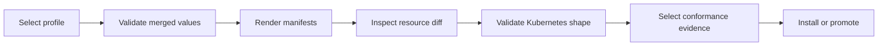

# Render and Validate a Deployment

Rendering turns values into the exact Kubernetes objects under review.
Validation asks whether those objects satisfy Atlas and Kubernetes contracts.
Neither step contacts a cluster unless the selected command explicitly does so.

## Preflight Sequence



Use one profile, chart identity, image identity, and run ID throughout the
sequence. Re-rendering with different inputs between validation and install
invalidates the evidence chain.

## Control-Plane Commands

Inspect the command and render the Kind profile without applying it:

```bash
bijux-atlas-dev --repo-root "$PWD" ops render \
  --profile kind \
  --target helm \
  --check \
  --allow-subprocess \
  --format json
```

Validate the selected operational profile:

```bash
bijux-atlas-dev --repo-root "$PWD" ops validate \
  --profile kind \
  --allow-subprocess \
  --format json
```

The control plane requires subprocess permission when it invokes Helm or
another external validator. Writing reports or governed output requires the
separate write capability. Grant only the effects the selected operation needs.

## Inspect the Rendered Release

Review the rendered objects as a connected system:

- the Deployment or Rollout uses the expected image digest and command;
- ConfigMap keys match the runtime configuration contract;
- Service ports, probe paths, container ports, and metric ports agree;
- selectors and labels connect workloads, Services, monitors, and policies;
- security contexts preserve non-root, read-only filesystem, and dropped
  capability requirements;
- NetworkPolicy allows only the dependencies selected by the profile;
- HPA, PDB, replica count, and rollout strategy do not contradict one another;
- warmup, catalog publication, storage, and audit resources appear only when
  their values enable them.

Use a resource-level diff against the approved release for upgrade and rollback
review. A summary that hides deleted policy, probe, or identity fields is not
sufficient.

## Evidence and Interpretation

Render and validation reports belong under the repository artifact root for
the run. Governed summaries and inventories under `ops/k8s/generated/` describe
the checked-in release surface; update them through their generator when the
governed source changes.

| Result | Meaning |
| --- | --- |
| Values failure | The requested profile is unknown, malformed, or violates schema relationships |
| Render failure | Chart logic, source assets, or the selected values cannot produce manifests |
| Validation failure | Rendered resources violate a schema, policy, or Atlas contract |
| Conformance failure | Static shape may be valid, but the selected operational behavior is not proven |

A clean render proves deterministic template expansion. It does not prove image
availability, startup, dependency reachability, readiness, overload behavior,
or recovery. Proceed to [Conformance Suites](conformance-suites.md) and
[Rollout Safety](rollout-safety.md) for those claims.
