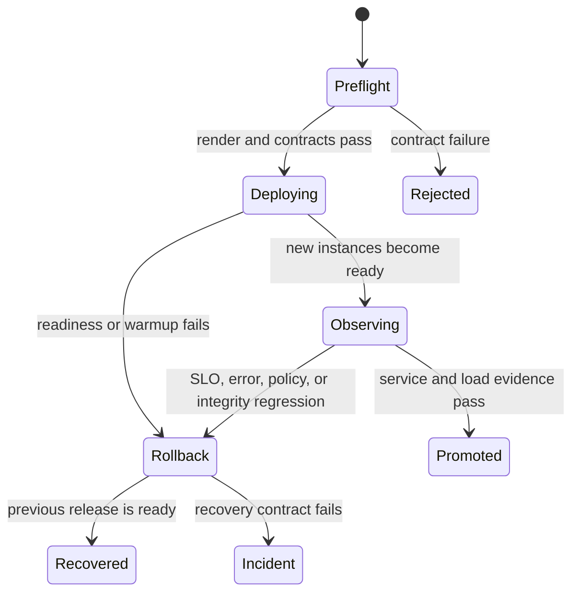

# Rollout Safety

A safe rollout preserves service admission, data availability, security
posture, and recovery authority while the running release changes. Atlas makes
these expectations profile-specific through
`ops/k8s/rollout-safety-contract.json`.

## Profile Safety Modes

| Profile | Delivery mode | Warmup required | Network policy | HPA |
| --- | --- | ---: | --- | --- |
| `ci` | Deployment | no | disabled | disabled |
| `dev` | Deployment | no | disabled | disabled |
| `kind` | Rollout | yes | cluster-aware | disabled |
| `offline` | Deployment | yes | disabled | disabled |
| `perf` | Rollout | no | cluster-aware | enabled |
| `prod` | Rollout | no | cluster-aware | enabled |

Every profile requires a readiness path. Kind requires warmup before promotion;
offline requires prewarming and pinned datasets while forbidding live-catalog
readiness. Performance requires a digest-pinned image and service monitoring.
Production requires HPA and cluster-aware dependency isolation.

## Promotion State Machine

Do not promote on pod phase alone. Promotion requires readiness to stabilize,
traffic to reach the new release, expected telemetry to arrive, and the
selected load or resilience evidence to remain inside budget.

## Decision Gates

| Gate | Required state | Failure action |
| --- | --- | --- |
| preflight | versions, digests, values, render, policy, and rollback target resolve | reject before mutation |
| admission | workloads schedule with intended identity, security, and dependencies | hold or remove candidate |
| readiness | candidate completes profile-specific startup and enters endpoints | roll back or diagnose readiness |
| traffic | representative request classes reach the candidate | hold; do not infer behavior from idle pods |
| observation | correctness, latency, errors, saturation, and telemetry remain acceptable | drain candidate and roll back |
| recovery | previous release restores traffic and dataset behavior | escalate to incident response |

Each gate has a different rollback cost. Rejecting at preflight avoids cluster
mutation. Failing after traffic shift requires preserving candidate-scoped
signals before draining it. Recovery failure ends the routine rollout path.

## Observe During Change

Track at least:

- ready, live, draining, and overload states by release identity;
- request rate, error rate, latency distributions, and heavy-work shedding;
- restart, scheduling, image-pull, and dependency failures;
- warmup and catalog discovery progress where required;
- HPA decisions, replica availability, and PDB constraints;
- audit, authentication, and network-policy failures;
- store integrity and dataset-resolution errors.

Compare the new and previous releases over the same observation window. A
global average can hide a failing candidate behind healthy old replicas.

## Rollback Triggers

Begin rollback when the candidate cannot become ready within the declared
window, loses required policy or configuration, violates latency or error
budgets, cannot resolve governed datasets, or causes cheap-path survival to
fail under load. Also roll back when required telemetry is absent: an
unobservable candidate is not safe to promote.

Stop automatic rollback and escalate to incident response when the previous
release cannot recover, shared data or catalog state may be damaged, or the
rollback would violate a known compatibility boundary.

Rollback is not safe when the previous runtime cannot consume the current
configuration, catalog, or dataset state. Resolve those compatibility
directions during preflight. If shared state changed unexpectedly, freeze the
state and investigate rather than cycling releases.

## Required Record

Preserve the baseline and target release identities, selected profile, rendered
diff, conformance report, rollout timestamps, probe transitions, relevant
metrics and traces, rollback decision, and final service state. For an upgrade
or rollback claim, the install matrix must also declare the corresponding
lifecycle scenario.

See [Health Readiness and Drain](../observability/health-readiness-and-drain.md)
for endpoint semantics and [Rollout Under Load](../load/rollout-under-load.md)
for traffic evidence.
